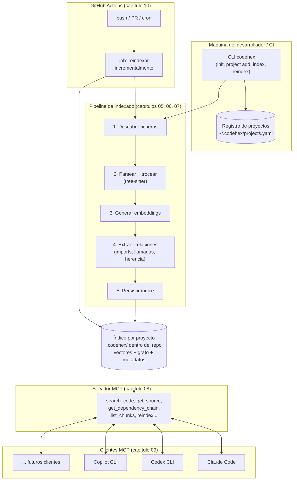

# 00 · Visión general

## Qué vas a construir

Un sistema, `codehex`, con tres partes que se ejecutan en momentos distintos pero comparten el mismo índice:

1. **Un indexador** que recorre un repositorio de código, lo trocea en unidades con sentido (funciones, clases, métodos), genera una representación vectorial (embedding) y estructural (grafo de dependencias) de cada una, y lo persiste en disco.
2. **Un servidor MCP** que, dado ese índice ya construido, responde a preguntas de un agente LLM ("¿dónde se valida el email del usuario?", "¿qué implementa esta interfaz?", "enséñame el código de esta función") sin que el agente tenga que leer el repositorio entero.
3. **Un disparador automático** (GitHub Actions) que ejecuta el indexador cada vez que el código cambia, para que el índice nunca quede desactualizado más que unos minutos.

Todo ello para **varios proyectos a la vez** — no un índice hardcodeado a un único repo, sino un registro de proyectos que puedes añadir, quitar y consultar independientemente.

## El mapa completo

## Las cuatro preguntas que resuelve cada capítulo

Antes de entrar en detalle, conviene tener claro **qué problema resuelve cada pieza**, porque es fácil perderse en los detalles técnicos y perder de vista el porqué:

| Pieza | Pregunta que resuelve | Capítulo |
|---|---|---|
| Chunking estructural | "¿Cómo trocexo código sin partir una función por la mitad?" | 02, 05 |
| Embeddings + vector store | "¿Cómo encuentro código relevante por *significado*, no solo por texto exacto?" | 01, 06 |
| Grafo de dependencias | "¿Cómo sé qué depende de qué, sin que un LLM tenga que inferirlo leyendo 50 ficheros?" | 02, 03 |
| Arquitectura hexagonal | "¿Cómo evito que añadir Java o cambiar de vector store obligue a reescribir todo?" | 03 |
| Registro multi-proyecto | "¿Cómo indexo y consulto 10 repos distintos sin 10 instalaciones distintas?" | 04 |
| Indexación incremental | "¿Cómo reindexo un repo de 500k líneas en segundos, no en minutos, tras un cambio pequeño?" | 07 |
| Servidor MCP | "¿Cómo hablo este índice con un agente LLM de forma estándar?" | 08 |
| Integración de clientes | "¿Cómo se entera Claude Code / Codex / Copilot de que este servidor existe?" | 09 |
| GitHub Actions | "¿Cómo evito tener que acordarme de reindexar a mano?" | 10 |

## Qué NO es este sistema

- **No es un chatbot ni un agente**: no genera respuestas por sí mismo. Es infraestructura de recuperación — el LLM (Claude, GPT, etc.) sigue siendo quien razona y responde; `codehex` solo le da acceso eficiente al código relevante.
- **No sustituye a `git grep` para todo**: para una búsqueda de texto exacto y puntual, `grep`/`ripgrep` sigue siendo más rápido. `codehex` aporta valor cuando la búsqueda es semántica ("código que valida tarjetas de crédito") o quieres navegar relaciones estructurales sin leer archivo por archivo.
- **No requiere entender matemáticas de embeddings a fondo**: se usan como una caja con una propiedad concreta y suficiente (capítulo 01): cosas parecidas en significado quedan cerca en el espacio vectorial. Con eso basta para diseñar el sistema.

## Cómo seguir desde aquí

Continúa con [01 · Fundamentos de RAG](01-fundamentos-rag.md) si necesitas afianzar los conceptos base, o salta a [03 · Arquitectura hexagonal](03-arquitectura-hexagonal.md) si ya los dominas y quieres ir directo al diseño.
