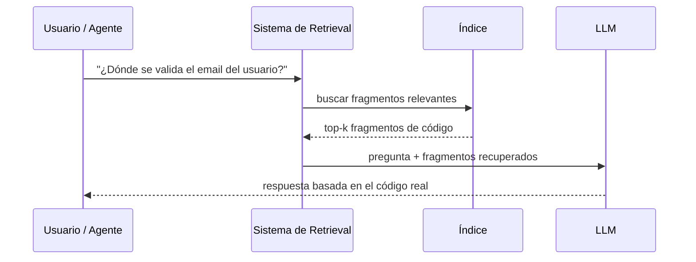
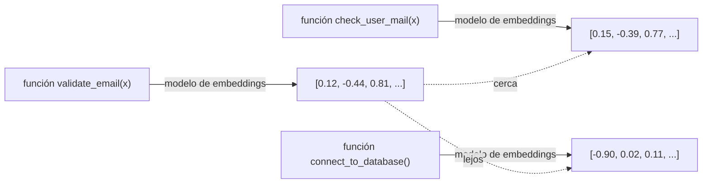

# 01 · Fundamentos de RAG

Este capítulo asume que sabes qué es un LLM (un modelo que predice texto dado un contexto) pero no has entrado en el detalle de cómo se construye un sistema de recuperación real. Si ya conoces embeddings, similitud coseno y chunking a fondo, puedes saltar a [02](02-code-rag-particularidades.md).

## 1. Por qué existe RAG

Un LLM solo "sabe" dos cosas: lo que aprendió durante su entrenamiento (congelado en una fecha) y lo que le metes en el contexto de la conversación (el prompt). No sabe nada de tu repositorio privado, y aunque lo supiera, un repositorio grande no cabe entero en una ventana de contexto — y aunque cupiera, mandarlo entero en cada pregunta sería lento y caro.

**RAG (Retrieval-Augmented Generation)** resuelve esto con una idea simple: en vez de que el modelo "sepa" tu código de memoria, le das una forma de **buscar** el fragmento relevante y meterlo en el contexto justo antes de responder. El nombre lo dice todo: *Retrieval* (recuperar lo relevante) + *Augmented Generation* (generación de texto, pero aumentada con esa información recuperada).

Nota algo importante: **el LLM nunca "contiene" tu código**. Solo lo ve en el momento de responder, igual que tú abres un fichero para leerlo antes de contestar una pregunta sobre él. Esto es clave para entender qué se persiste (sección 4).

## 2. Embeddings: el ingrediente central

Un **embedding** es un vector de números (por ejemplo, 768 o 1536 números decimales) que representa el *significado* de un texto. Se genera pasando el texto por un modelo entrenado para esto (un "modelo de embeddings", distinto del LLM que genera texto).

La propiedad que lo hace útil, y la única que necesitas para diseñar el sistema, es:

> **Textos con significado parecido producen vectores cercanos entre sí en ese espacio de números.**

"Cercano" se mide normalmente con **similitud coseno**: el coseno del ángulo entre dos vectores. Vale 1 si apuntan exactamente en la misma dirección (máxima similitud), 0 si son perpendiculares (sin relación), y -1 si son opuestos. No necesitas la fórmula para diseñar el sistema — solo necesitas saber que es un número entre -1 y 1 que un vector store calcula por ti al buscar.

Aunque `validate_email` y `check_user_mail` no comparten ni una palabra literal, el modelo de embeddings los coloca cerca porque *significan* algo parecido. Esto es lo que hace que la búsqueda sea **semántica** y no solo textual — la diferencia central frente a un `grep`.

## 3. Chunking: qué unidad se indexa

No metes un repositorio entero a un modelo de embeddings de una vez — el resultado sería un vector demasiado genérico ("esto es un repositorio de software", sin matiz). En su lugar, lo divides en **chunks**: unidades más pequeñas, cada una con su propio embedding.

Cómo se decide dónde cortar es una decisión de diseño con impacto directo en la calidad de la búsqueda — tanto que el [capítulo 02](02-code-rag-particularidades.md) está dedicado en exclusiva a esto para el caso del código. Por ahora, quédate con la idea general: un chunk demasiado grande diluye el significado (el embedding se vuelve "promedio" de muchas cosas distintas); uno demasiado pequeño pierde contexto (una línea suelta sin la función que la rodea dice poco).

## 4. Qué se persiste realmente — la pregunta clave

Esta es la pregunta que probablemente más confusión genera cuando se entra en RAG por primera vez, y la que el usuario de esta guía específicamente quería tener clara antes de diseñar nada. La respuesta corta:

> **No se persiste "conocimiento". Se persisten vectores + metadatos + un puntero al contenido original.**

Desglosado, por cada chunk se guarda normalmente:

| Campo | Qué es | Ejemplo |
|---|---|---|
| **Embedding** | El vector numérico calculado a partir del texto del chunk | `[0.12, -0.44, 0.81, ...]` (768 floats) |
| **Texto del chunk (o puntero)** | El contenido real, o una referencia a dónde leerlo | el código fuente de la función, o `fichero.py:40-58` |
| **Metadatos** | Datos estructurados sobre el chunk, usados para filtrar y para mostrar resultados | lenguaje, nombre de función/clase, ruta del fichero, hash del commit indexado |

Lo que **no** se persiste ni se transforma es el código en sí — el vector no es una compresión reversible del texto (no puedes reconstruir el código a partir del embedding). Por eso casi todo sistema de code-RAG serio guarda **también** el texto o al menos la ruta+líneas exactas: el embedding solo sirve para *encontrar*, no para *mostrar*. Cuando el LLM necesita ver el código real, se lee del fichero (o del texto guardado), no del vector.

Esto tiene una implicación de diseño importante que aparece en el [capítulo 06](06-embeddings-vector-store.md): **el vector store no reemplaza al control de versiones**. Guarda una copia del texto (o simplemente la ruta y el rango de líneas, reconstruible mientras el repo no cambie de forma incompatible) junto al vector, para poder devolver contenido real, no solo un número de similitud.

## 5. Vector store: dónde vive esto

Un **vector store** (o "base de datos vectorial") es un almacén especializado en guardar muchos vectores y responder eficientemente a la pregunta "¿cuáles son los k vectores más cercanos a este vector de consulta?" (**k-NN**, k-nearest-neighbors, aproximado en la práctica para que escale — **ANN**, approximate nearest neighbors).

No es fundamentalmente distinto de una base de datos relacional en su rol: guarda datos y te deja consultarlos. La diferencia es el tipo de consulta que optimiza (similitud vectorial en vez de igualdad/rango sobre columnas) y, en el caso de este proyecto, se explora en detalle en el capítulo 06, incluyendo por qué para un gestor de code-RAGs local conviene uno **embebido** (sin servidor externo que levantar).

## 6. Retrieval léxico vs. semántico vs. híbrido

| Tipo | Cómo busca | Fuerte en | Débil en |
|---|---|---|---|
| **Léxico** (keyword / full-text) | Coincidencia de palabras/subcadenas, con scoring tipo BM25 o ad-hoc | Símbolos exactos: nombres de excepción, de función, de variable | Sinónimos, paráfrasis, "busca algo que haga X" sin saber el nombre exacto |
| **Semántico** (embeddings) | Similitud vectorial | Preguntas conceptuales, código con nombres distintos pero función parecida | Precisión exacta de un identificador poco común; puede traer "casi lo mismo" cuando querías *justo eso* |
| **Híbrido** | Combina ambos (y a veces señales estructurales) | Lo mejor de ambos mundos | Más piezas que mantener |

Para código, la práctica establecida (y la que sigue esta guía, ver capítulo 02) es **híbrida**: ni el léxico solo ni el semántico solo son suficientes, porque el código tiene identificadores exactos que importan (nombres de excepciones, de endpoints) *y* relaciones de significado que un `grep` no captura.

## 7. Cómo se mide si un RAG funciona bien

No hace falta profundizar en matemáticas de evaluación para diseñar el sistema, pero conviene conocer el vocabulario mínimo:

- **top-k**: cuántos resultados devuelve una búsqueda (p.ej. "los 10 chunks más relevantes").
- **recall@k**: de todos los chunks realmente relevantes para una consulta, ¿qué fracción aparece entre los primeros k resultados? Si la respuesta correcta está en el chunk 15 y pides top-10, tu recall@10 para esa consulta es 0.
- **precisión**: de los k resultados devueltos, ¿cuántos son realmente relevantes? Alta precisión y bajo recall = resultados correctos pero incompletos. Alto recall y baja precisión = lo encuentras, pero rodeado de ruido.

Estas métricas importan cuando afines el `limit`/`top_k` por defecto de tus herramientas MCP (capítulo 08) o cuando decidas si el retrieval híbrido está funcionando mejor que el semántico solo — pero no son un bloqueante para empezar a construir.

## Ideas reutilizables de los proyectos existentes

Ninguno de los dos proyectos hermanos (`kairosai`, `code-rag-mcp`) implementa embeddings ni vector store — este capítulo es terreno nuevo. Pero `code-rag-mcp` sí demuestra, en la práctica, la mitad "léxica" de la tabla de la sección 6: su `search_code` puntúa coincidencias de texto (nombre de clase, métodos, excepciones) sin ningún componente semántico. Es un buen ejemplo de hasta dónde llega el retrieval léxico solo — y de por qué, en el capítulo 02, se propone añadirle la mitad semántica en vez de sustituirlo.

## Siguiente paso

[02 · Particularidades del code-RAG](02-code-rag-particularidades.md): por qué aplicar RAG a código no es lo mismo que aplicarlo a documentos de texto.
