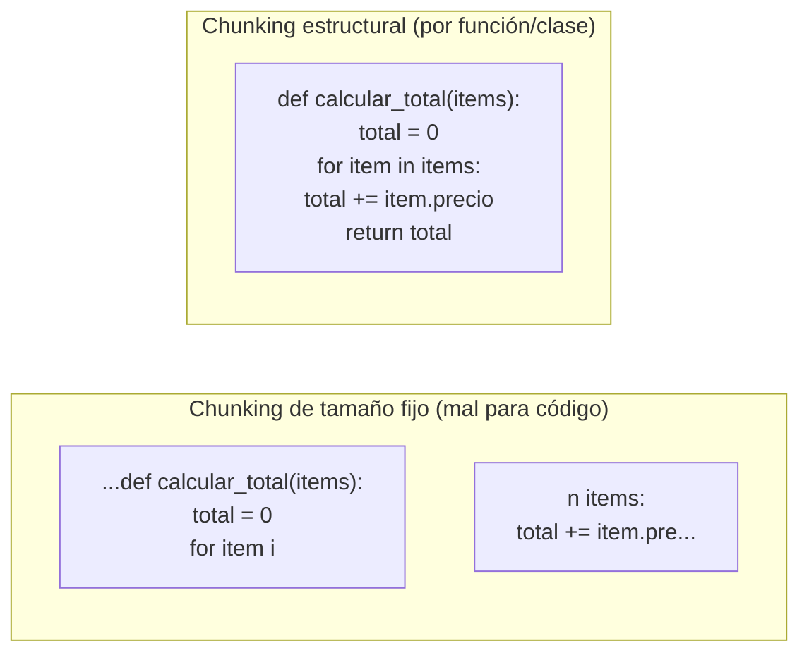

# 02 · Particularidades del code-RAG

Un RAG sobre documentación o artículos y un RAG sobre código comparten los fundamentos del capítulo 01, pero el código tiene propiedades que un sistema de "trocea y vectoriza" genérico ignora, y que hay que diseñar explícitamente.

## 1. El código no es prosa

Si aplicas chunking de tamaño fijo (p.ej. "trocea cada 500 caracteres con solapamiento de 50") a un fichero de código, vas a partir funciones por la mitad, separar una firma de su cuerpo, o mezclar el final de una clase con el principio de la siguiente. El embedding resultante de un chunk así representa un fragmento sintácticamente incompleto — "significa" peor que si respetara los límites del lenguaje.

La alternativa, y la que usa esta guía, es el **chunking estructural**: cortar en los límites que el propio lenguaje ya define — función, método, clase, interfaz — usando un parser real en vez de contar caracteres. El [capítulo 05](05-parsing-multilenguaje.md) cubre cómo hacerlo con tree-sitter para varios lenguajes.



## 2. El código tiene relaciones explícitas que un embedding no captura bien

Un embedding responde bien a "¿qué se parece a esto en significado?". Responde mal a preguntas como:

- "¿Qué clases implementan esta interfaz?"
- "¿Qué le pasa a este endpoint si borro esta tabla?"
- "¿Quién llama a esta función?"

Estas son preguntas sobre **estructura**, no sobre significado — y el código ya contiene esa estructura de forma explícita y perfectamente extraíble: imports, `implements`/`extends`, llamadas a función, claves foráneas en SQL. Ignorar esto y depender solo de similitud semántica es tirar información gratis.

Por eso el diseño de esta guía no es "RAG con embeddings" a secas, sino un **índice híbrido de tres capas**:

| Capa | Qué responde | Cómo se construye |
|---|---|---|
| **Semántica** (embeddings) | "Encuéntrame código que haga algo parecido a X" | Modelo de embeddings sobre cada chunk (capítulo 06) |
| **Léxica** (keywords) | "Encuéntrame el símbolo exacto `PRODUCT_SKU_ALREADY_EXISTS`" | Scoring por coincidencia de texto sobre nombre/metadatos del chunk |
| **Estructural** (grafo) | "¿Qué implementa esto? ¿Quién depende de esto?" | Grafo de aristas dirigidas extraídas por el parser (implements, extends, llamada, FK) |

Ninguna de las tres sustituye a las otras dos. Se combinan en tiempo de consulta (capítulo 08): una búsqueda normal usa semántica+léxica con scoring combinado, y una pregunta de navegación usa el grafo con un recorrido BFS/DFS sobre las aristas.

## 3. Caso de estudio: `code-rag-mcp`, la mitad "sin embeddings" ya resuelta

El proyecto hermano `code-rag-mcp` (en esta misma carpeta `ai/`) es un ejemplo real y funcional de las capas léxica + estructural, sin la capa semántica. Merece la pena mirarlo como referencia porque ya validó, en un proyecto Java real, dos piezas que esta guía reutiliza conceptualmente:

**Modelo de datos.** Cada unidad indexada (`CodeChunk`) guarda identidad (nombre completo, módulo), clasificación (capa arquitectónica, rol — `entity`, `port-in`, `adapter`, `controller`...), estructura (campos, métodos con firma y llamadas, `implements`/`extends`) y un resumen textual generado por reglas. Las relaciones (`DependencyEdge`) son aristas tipadas (`IMPLEMENTS`, `EXTENDS`, `FIELD_INJECTION`, `FOREIGN_KEY`, `IMPORT`) entre chunks. Esto es, casi literalmente, el modelo de dominio propuesto en el [capítulo 03](03-arquitectura-hexagonal.md) — solo le falta el campo `embedding`.

**Grafo en memoria para navegación.** Al arrancar, construye mapas (`chunksByFqcn`, `outEdges`/`inEdges` como listas de adyacencia, `reverseDeps`) que permiten responder "¿quién depende de X?" en O(1) y recorrer el grafo con BFS en O(V+E) — sin base de datos de grafos, todo en memoria a partir de un JSON. Para el volumen de código de un repositorio típico (miles, no millones, de símbolos), esto es más que suficiente y evita añadir infraestructura.

Lo que le falta, y que esta guía sí cubre, es exactamente la capa semántica (embeddings + vector store, capítulo 06), soporte multi-lenguaje real (capítulo 05), soporte multi-proyecto (capítulo 04) y automatización vía CI (capítulo 10).

## 4. Qué se persiste, en concreto, para código

Retomando la pregunta del capítulo 01 ("¿qué se guarda realmente?"), para un chunk de código el registro completo típico incluye:

```
CodeChunk
├── id                    # identificador estable (p.ej. hash de fqcn+ruta)
├── embedding             # vector, capa semántica
├── texto / puntero       # código fuente del chunk, o (ruta, línea_inicio, línea_fin)
├── lenguaje              # python | javascript | java | ...
├── símbolo               # nombre de función/clase/método
├── ruta_fichero
├── hash_commit_indexado  # para saber si sigue vigente (capítulo 07)
└── metadatos             # firma, docstring/comentario, capa/rol si se clasifica (opcional)

DependencyEdge
├── origen   (id de chunk)
├── destino  (id de chunk)
└── tipo     # IMPORTS | CALLS | IMPLEMENTS | EXTENDS | FOREIGN_KEY | ...
```

Ni el embedding ni el grafo sustituyen al repositorio git — siguen siendo una capa de índice *derivada* del código, reconstruible en cualquier momento a partir de él. Esto es intencional: significa que el índice se puede borrar y regenerar sin pérdida de información real, lo cual simplifica enormemente el diseño (no hay migración de datos "irremplazables", solo caché reconstruible).

## 5. Enriquecimiento opcional: clasificación de capa/rol

`code-rag-mcp` también clasifica cada chunk por capa arquitectónica (`domain`, `application`, `infrastructure`...) y rol (`entity`, `port-in`, `adapter`, `controller`...) usando heurísticas sobre el paquete y las anotaciones (p.ej., algo en un paquete `...domain...` que es una interfaz sin anotaciones es probablemente un *port*; algo anotado `@RestController` es un *controller*).

Esto es **valioso pero opcional** — no es parte del núcleo de un code-RAG, es un enriquecimiento sobre el modelo base que mejora el filtrado (`search_code { layer: "domain" }`) cuando el código sigue una convención arquitectónica reconocible (hexagonal, capas, Spring/FastAPI con decoradores). Si tu primer proyecto indexado no sigue ninguna convención clara, sáltatelo sin miedo — el sistema funciona igual sin esta capa, solo pierdes un filtro adicional. Se retoma como extensión opcional en el capítulo 05.

## Ideas reutilizables de los proyectos existentes

- **De `code-rag-mcp`**: el modelo `CodeChunk`/`DependencyEdge` como base del modelo de dominio (capítulo 03); el patrón de mapas en memoria (`chunksByFqcn`, adjacency lists) para navegación de grafo sin infraestructura extra; los clasificadores puros de capa/rol como enriquecimiento opcional (capítulo 05); el algoritmo de reindexado incremental vía `git diff` (capítulo 07).
- **De `kairosai`**: nada específico de code-RAG — su aportación llega en el capítulo 04 (gestión multi-proyecto).

## Siguiente paso

[03 · Arquitectura hexagonal](03-arquitectura-hexagonal.md): cómo organizar todo esto — parser, embeddings, vector store, grafo, MCP — para que cada pieza se pueda sustituir sin tocar las demás.
