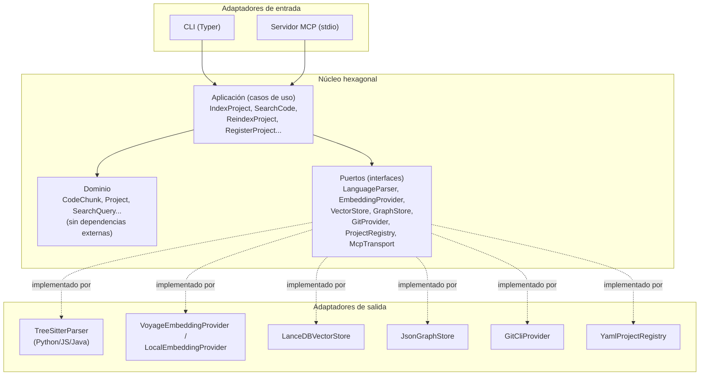

# 03 · Arquitectura hexagonal

Este es el capítulo central de la guía: la decisión de arquitectura que hace que todo lo demás (multi-lenguaje, multi-proyecto, multi-cliente MCP, distintos vector stores) sea "añadir un adaptador" en vez de "reescribir el núcleo".

## 1. La idea, sin jerga

Un sistema hexagonal separa dos cosas que casi siempre se mezclan por comodidad:

- **El dominio**: las reglas y conceptos propios de tu problema — qué es un `CodeChunk`, qué significa "indexar un proyecto", cómo se compara relevancia. No sabe nada de tree-sitter, de OpenAI, de LanceDB, ni de JSON-RPC. Es Python puro, sin dependencias externas de infraestructura.
- **La infraestructura**: las herramientas concretas que usas hoy para cumplir esas reglas — tree-sitter para parsear, un modelo de embeddings concreto, un vector store concreto, stdio para hablar MCP. Estas piezas **cambian con el tiempo** (hoy usas tree-sitter, mañana quizá un parser distinto; hoy usas un modelo de embeddings local, mañana uno de pago).

La arquitectura hexagonal dice: el dominio define **puertos** (interfaces — "necesito algo que sepa parsear código y devolverme chunks", sin decir cómo). La infraestructura implementa esos puertos con **adaptadores** concretos (`TreeSitterPythonParser`, `VoyageEmbeddingProvider`...). El dominio nunca importa un adaptador directamente — solo conoce el puerto.



La regla de dependencia es siempre **hacia dentro**: los adaptadores conocen al dominio (a través de los puertos), el dominio nunca conoce a los adaptadores. Esto es lo que te permite, más adelante, escribir un `JavaScriptParser` sin tocar una sola línea de `IndexProject`, o sustituir LanceDB por Qdrant sin tocar `SearchCode`.

## 2. Por qué merece la pena aquí en concreto (y no es sobre-ingeniería)

Con arquitectura hexagonal siempre hay que preguntarse si el coste de la indirección compensa. En este proyecto, sí, por una razón muy concreta: **el enunciado del propio proyecto pide 4 ejes de variación independientes**:

1. Lenguaje del código indexado (Python, JS, Java, futuros) → varía el `LanguageParser`.
2. Proveedor de embeddings (local vs. API, y cuál) → varía el `EmbeddingProvider`.
3. Vector store (LanceDB, Chroma, Qdrant...) → varía el `VectorStore`.
4. Cliente MCP (Claude Code, Codex CLI, Copilot CLI, futuros) → esto en realidad no varía el `McpTransport` (todos hablan el mismo protocolo MCP), pero si mañana añades un transporte no-stdio (HTTP) sí sería un adaptador nuevo.

Cuando tienes de entrada varios ejes de variación conocidos (no hipotéticos: están en el encargo), separar puertos de adaptadores no es especulación — es la forma más barata de que el punto 5 (añadir Go, por ejemplo, dentro de un año) sea trivial.

## 3. Modelo de dominio

Entidades (siguiendo el ejemplo del capítulo 02, con el campo `embedding` que `code-rag-mcp` no tenía):

```python
# domain/models.py — sin imports de infraestructura, solo dataclasses/tipos

from dataclasses import dataclass, field
from enum import Enum

class EdgeType(str, Enum):
    IMPORTS = "imports"
    CALLS = "calls"
    IMPLEMENTS = "implements"
    EXTENDS = "extends"
    FOREIGN_KEY = "foreign_key"

@dataclass(frozen=True)
class CodeChunk:
    id: str                      # hash estable (ruta + símbolo + rango de líneas)
    project_id: str
    language: str                 # "python" | "javascript" | "java" | ...
    symbol: str                   # nombre de función/clase/método
    kind: str                     # "function" | "class" | "method" | "interface" | ...
    file_path: str
    start_line: int
    end_line: int
    source_text: str
    embedding: list[float] | None = None
    metadata: dict = field(default_factory=dict)   # firma, docstring, layer/role opcional

@dataclass(frozen=True)
class DependencyEdge:
    source_chunk_id: str
    target_chunk_id: str
    edge_type: EdgeType

@dataclass(frozen=True)
class Project:
    id: str
    name: str
    root_path: str
    languages: list[str]
    last_indexed_commit: str | None = None
    last_indexed_at: str | None = None

@dataclass(frozen=True)
class SearchQuery:
    project_id: str
    text: str
    top_k: int = 10
    language: str | None = None
    kind: str | None = None

@dataclass(frozen=True)
class SearchResult:
    chunk: CodeChunk
    score: float
    match_reason: str            # "semantic" | "lexical" | "hybrid"
```

Todo lo anterior es Python estándar — se puede probar con `pytest` sin levantar ningún servicio externo, sin mocks complejos. Esa es la señal de que el dominio está bien aislado.

## 4. Puertos

Cada puerto es una interfaz (en Python, un `Protocol` o una clase base abstracta) que el dominio necesita y la infraestructura implementa:

| Puerto | Responsabilidad | Adaptadores de referencia (capítulos) |
|---|---|---|
| `LanguageParser` | Dado un fichero fuente, devolver `CodeChunk`s + `DependencyEdge`s | `TreeSitterPythonParser`, `TreeSitterJavaScriptParser`, `TreeSitterJavaParser`, `GenericTextParser` (fallback) — cap. 05 |
| `EmbeddingProvider` | Dado un texto, devolver su vector | `VoyageEmbeddingProvider`, `LocalSentenceTransformerProvider` — cap. 06 |
| `VectorStore` | Persistir vectores + metadatos; buscar los k más cercanos | `LanceDbVectorStore`, `ChromaVectorStore` — cap. 06 |
| `GraphStore` | Persistir y consultar `DependencyEdge`s; recorrido BFS/DFS | `JsonGraphStore` (in-memory + fichero) — cap. 02, 07 |
| `GitProvider` | Diff entre commits, estado del árbol de trabajo | `GitCliProvider` (subprocess sobre `git`) — cap. 07 |
| `ProjectRegistry` | Alta/baja/listado de proyectos gestionados | `YamlProjectRegistry` — cap. 04 |
| `McpTransport` | Recibir/enviar mensajes JSON-RPC del protocolo MCP | `StdioMcpTransport` (vía SDK oficial) — cap. 08 |

Ejemplo de puerto en código:

```python
# ports/language_parser.py
from typing import Protocol
from domain.models import CodeChunk, DependencyEdge

class LanguageParser(Protocol):
    def supports(self, file_path: str) -> bool: ...

    def parse(self, project_id: str, file_path: str, source: str) -> tuple[list[CodeChunk], list[DependencyEdge]]: ...
```

```python
# ports/embedding_provider.py
from typing import Protocol

class EmbeddingProvider(Protocol):
    def embed_batch(self, texts: list[str]) -> list[list[float]]: ...
```

```python
# ports/vector_store.py
from typing import Protocol
from domain.models import CodeChunk, SearchResult

class VectorStore(Protocol):
    def upsert(self, project_id: str, chunks: list[CodeChunk]) -> None: ...
    def delete(self, project_id: str, chunk_ids: list[str]) -> None: ...
    def search(self, project_id: str, query_embedding: list[float], top_k: int) -> list[SearchResult]: ...
```

Nota el `project_id` en todos los métodos de `VectorStore` y `GraphStore` — es la costura donde encaja el diseño multi-proyecto del capítulo 04: cada operación está siempre acotada a un proyecto (namespace/colección), nunca "global".

## 5. Casos de uso (capa de aplicación)

Los casos de uso orquestan puertos para cumplir una operación de negocio completa. Viven en `application/`, dependen de los puertos (nunca de adaptadores concretos) y se inyectan por constructor:

```python
# application/index_project.py
class IndexProject:
    def __init__(self, parser: LanguageParser, embedder: EmbeddingProvider,
                 vector_store: VectorStore, graph_store: GraphStore,
                 registry: ProjectRegistry, git: GitProvider):
        self._parser = parser
        self._embedder = embedder
        self._vector_store = vector_store
        self._graph_store = graph_store
        self._registry = registry
        self._git = git

    def execute(self, project_id: str) -> IndexStats:
        project = self._registry.get(project_id)
        chunks, edges = [], []
        for file_path, source in discover_files(project.root_path):
            if not self._parser.supports(file_path):
                continue
            file_chunks, file_edges = self._parser.parse(project_id, file_path, source)
            chunks.extend(file_chunks)
            edges.extend(file_edges)

        embeddings = self._embedder.embed_batch([c.source_text for c in chunks])
        chunks = [replace(c, embedding=e) for c, e in zip(chunks, embeddings)]

        self._vector_store.upsert(project_id, chunks)
        self._graph_store.upsert_edges(project_id, edges)
        self._registry.mark_indexed(project_id, commit=self._git.head(project.root_path))
        return IndexStats(total_chunks=len(chunks), total_edges=len(edges))
```

Casos de uso principales que necesitarás (uno por fichero en `application/`, uno-a-uno con las herramientas MCP del capítulo 08):

- `RegisterProject` / `ListProjects` / `RemoveProject` (capítulo 04)
- `IndexProject` (full, arriba) / `ReindexProject` (incremental, capítulo 07)
- `SearchCode` (híbrido semántico+léxico, capítulo 06)
- `GetDependencyChain` (BFS sobre `GraphStore`, capítulo 02)
- `GetSource` (lee texto/puntero del chunk)
- `ListChunks` / `GetIndexStats`

## 6. Adaptadores

Los adaptadores viven en `adapters/<nombre>/`, importan librerías externas libremente (tree-sitter, el SDK de tu proveedor de embeddings, el cliente de tu vector store) y son la **única** capa que sabe que esas librerías existen. Implementan un puerto y nada más — no contienen lógica de negocio.

```python
# adapters/parsers/tree_sitter_python.py
import tree_sitter_python as tspython
from tree_sitter import Language, Parser
from ports.language_parser import LanguageParser
from domain.models import CodeChunk, DependencyEdge

class TreeSitterPythonParser(LanguageParser):
    def __init__(self):
        self._parser = Parser(Language(tspython.language()))

    def supports(self, file_path: str) -> bool:
        return file_path.endswith(".py")

    def parse(self, project_id, file_path, source):
        tree = self._parser.parse(source.encode())
        # recorrer el árbol, extraer nodos function_definition / class_definition
        # (detalle completo en el capítulo 05)
        ...
```

Cada adaptador de entrada (CLI, servidor MCP) construye el grafo de dependencias completo (elige qué adaptador de salida usar para cada puerto, según configuración) y se lo inyecta a los casos de uso — típicamente en un pequeño módulo de composición (`composition_root.py` o `container.py`), el único sitio del proyecto donde se "conectan los cables":

```python
# composition_root.py
def build_index_project_use_case(config: ProjectConfig) -> IndexProject:
    parser = CompositeLanguageParser([
        TreeSitterPythonParser(), TreeSitterJavaScriptParser(),
        TreeSitterJavaParser(), GenericTextParser(),   # fallback, siempre el último
    ])
    embedder = build_embedding_provider(config.embedding)   # local o API, según config
    vector_store = LanceDbVectorStore(config.index_dir)
    graph_store = JsonGraphStore(config.index_dir)
    registry = YamlProjectRegistry(config.registry_path)
    git = GitCliProvider()
    return IndexProject(parser, embedder, vector_store, graph_store, registry, git)
```

## 7. Layout de carpetas propuesto

```
codehex/
├── pyproject.toml
├── src/codehex/
│   ├── domain/
│   │   └── models.py              # entidades, sin dependencias externas
│   ├── ports/
│   │   ├── language_parser.py
│   │   ├── embedding_provider.py
│   │   ├── vector_store.py
│   │   ├── graph_store.py
│   │   ├── git_provider.py
│   │   └── project_registry.py
│   ├── application/
│   │   ├── index_project.py
│   │   ├── reindex_project.py
│   │   ├── search_code.py
│   │   ├── get_dependency_chain.py
│   │   ├── register_project.py
│   │   └── ...
│   ├── adapters/
│   │   ├── parsers/
│   │   │   ├── tree_sitter_python.py
│   │   │   ├── tree_sitter_javascript.py
│   │   │   ├── tree_sitter_java.py
│   │   │   └── generic_text.py
│   │   ├── embeddings/
│   │   │   ├── voyage_provider.py
│   │   │   └── local_provider.py
│   │   ├── storage/
│   │   │   ├── lancedb_vector_store.py
│   │   │   └── json_graph_store.py
│   │   ├── git/git_cli_provider.py
│   │   ├── registry/yaml_project_registry.py
│   │   ├── cli/                   # adaptador de entrada: comandos Typer
│   │   └── mcp/                   # adaptador de entrada: servidor MCP stdio
│   └── composition_root.py
└── tests/
    ├── domain/          # tests puros, sin mocks
    ├── application/     # tests con dobles de prueba de los puertos
    └── adapters/        # tests de integración por adaptador
```

Este layout es una evolución directa del layout que ya se ve en `code-rag-mcp` (`model/`, `extractor/`, `search/`, `mcp/`) — solo que allí no hay una capa `ports/` explícita (todo se instancia directamente), lo cual es la limitación que este capítulo corrige.

## Ideas reutilizables de los proyectos existentes

- **De `code-rag-mcp`**: el modelo de datos como registros inmutables (aquí, `@dataclass(frozen=True)`); la separación conceptual extractor/modelo/búsqueda, formalizada aquí como adaptador/dominio/aplicación vía puertos explícitos.
- **De `kairosai`**: el split read/write (`config.py` vs `mutations.py`) es, en espíritu, la misma idea que separar `ListProjects` (lectura) de `RegisterProject` (escritura) como casos de uso independientes en vez de un único "gestor" con todo mezclado.

## Siguiente paso

[04 · Diseño multi-proyecto](04-diseno-multi-proyecto.md): cómo encaja el `ProjectRegistry` para gestionar varios repos desde una sola instalación.
