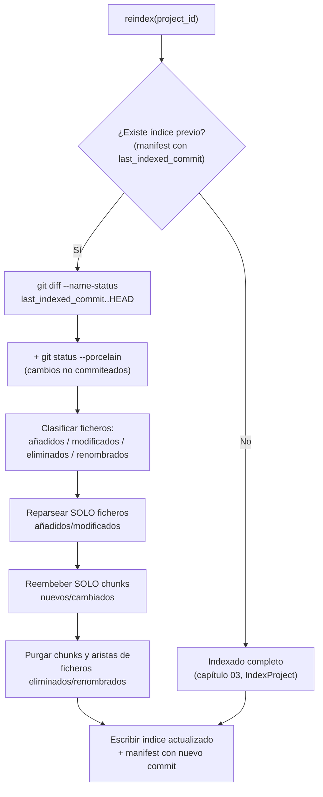

# 07 · Indexación incremental

## 1. Por qué importa

Sin reindexado incremental, cada cambio (aunque sea en un solo fichero) obligaría a: reparsear todo el repositorio, regenerar todos los embeddings (coste y tiempo proporcional al tamaño total, no al cambio) y reconstruir el grafo entero. Para un repositorio de tamaño moderado esto puede tardar minutos — inaceptable si quieres reindexar en cada push (capítulo 10) o si un agente pide `reindex` tras hacer un cambio y espera una respuesta rápida.

La solución, ya validada en producción por `code-rag-mcp` para el caso Java-only, es **reindexado basado en `git diff`**: la fuente de verdad de "qué cambió" no es un escaneo de timestamps de fichero (poco fiable: un `git checkout` puede tocar timestamps sin cambiar contenido), sino la comparación entre el commit indexado la última vez y el commit (o estado del árbol de trabajo) actual.

## 2. El algoritmo



Puntos clave del algoritmo, con la razón de cada uno:

1. **Sin índice previo → indexado completo.** Caso base, sin sorpresas.
2. **Con índice previo → diff contra el commit guardado**, no contra "el commit anterior a HEAD" — porque puede que hayan pasado varios commits desde la última vez que se indexó (p.ej. el CI del capítulo 10 no corrió durante un tiempo, o el usuario reindexó manualmente hace días).
3. **Incluir también el árbol de trabajo** (`git status --porcelain`), no solo commits — si no, cambios locales sin commitear quedarían invisibles para el índice, lo cual rompe la utilidad del `reindex` bajo demanda mientras se está desarrollando.
4. **Purgar, no solo añadir.** Un fichero eliminado o renombrado deja chunks huérfanos en el vector store y aristas que apuntan a un `chunk_id` que ya no existe — hay que borrarlos explícitamente, si no el índice acumula basura indefinidamente (y en el caso de aristas, `get_dependency_chain` podría devolver referencias rotas).

## 3. Implementación

```python
# ports/git_provider.py
from typing import Protocol

class FileChange(NamedTuple):
    path: str
    status: str   # "added" | "modified" | "deleted" | "renamed"
    old_path: str | None = None

class GitProvider(Protocol):
    def head(self, repo_path: str) -> str: ...
    def diff_since(self, repo_path: str, since_commit: str) -> list[FileChange]: ...
    def working_tree_changes(self, repo_path: str) -> list[FileChange]: ...
```

```python
# adapters/git/git_cli_provider.py
import subprocess

class GitCliProvider:
    def head(self, repo_path: str) -> str:
        return self._run(repo_path, ["rev-parse", "HEAD"]).strip()

    def diff_since(self, repo_path: str, since_commit: str) -> list[FileChange]:
        out = self._run(repo_path, ["diff", "--name-status", since_commit, "HEAD"])
        return self._parse_name_status(out)

    def working_tree_changes(self, repo_path: str) -> list[FileChange]:
        out = self._run(repo_path, ["status", "--porcelain"])
        return self._parse_porcelain(out)

    def _run(self, repo_path: str, args: list[str]) -> str:
        result = subprocess.run(["git", "-C", repo_path, *args],
                                 capture_output=True, text=True, check=True)
        return result.stdout
```

```python
# application/reindex_project.py
class ReindexProject:
    def __init__(self, parser, embedder, vector_store, graph_store, registry, git):
        self._parser, self._embedder = parser, embedder
        self._vector_store, self._graph_store = vector_store, graph_store
        self._registry, self._git = registry, git

    def execute(self, project_id: str) -> IndexStats:
        project = self._registry.get(project_id)

        if project.last_indexed_commit is None:
            return self._index_project.execute(project_id)   # delega en indexado completo

        changes = self._git.diff_since(project.root_path, project.last_indexed_commit)
        changes += self._git.working_tree_changes(project.root_path)

        to_reparse = [c.path for c in changes if c.status in ("added", "modified")]
        to_remove = [c.old_path or c.path for c in changes if c.status in ("deleted", "renamed")]

        removed_chunk_ids = self._graph_store.chunk_ids_for_files(project_id, to_remove)
        self._vector_store.delete(project_id, removed_chunk_ids)
        self._graph_store.remove_files(project_id, to_remove)

        new_chunks, new_edges = [], []
        for path in to_reparse:
            source = read_file(project.root_path, path)
            chunks, edges = self._parser.parse(project_id, path, source)
            new_chunks.extend(chunks)
            new_edges.extend(edges)

        embeddings = self._embedder.embed_batch([c.source_text for c in new_chunks])
        new_chunks = [replace(c, embedding=e) for c, e in zip(new_chunks, embeddings)]

        self._vector_store.upsert(project_id, new_chunks)
        self._graph_store.upsert_edges(project_id, new_edges)
        self._graph_store.prune_dangling_edges(project_id)   # aristas que apuntaban a chunks eliminados
        self._registry.mark_indexed(project_id, commit=self._git.head(project.root_path))

        return IndexStats(reparsed=len(to_reparse), removed=len(to_remove), new_chunks=len(new_chunks))
```

## 4. Escritura atómica y el manifest

El manifest (parte del estado por proyecto, `<root>/.codehex/manifest.json`) registra qué commit está reflejado en el índice — es la pieza que permite al algoritmo de la sección 2 saber desde dónde diffear la próxima vez, y al `get_index_stats` del capítulo 08 responder "¿está el índice actualizado?" sin ambigüedad:

```json
{
  "project_id": "backend-java",
  "last_indexed_commit": "a3f9c21",
  "last_indexed_at": "2026-07-31T10:15:00Z",
  "total_chunks": 1842,
  "total_edges": 3021
}
```

Escríbelo **después** de que el vector store y el grafo se hayan actualizado con éxito, nunca antes — si el proceso se interrumpe a mitad de un reindex, es preferible que la próxima ejecución vuelva a intentar el mismo rango de commits (ligero desperdicio de trabajo) a que el manifest diga "todo indexado hasta X" cuando en realidad la escritura se cortó a medias (índice inconsistente y ningún reindex futuro lo detecta, porque cree que ya está al día).

## 5. Límite del algoritmo: entornos sin git

El diff incremental depende de que el proyecto sea un repositorio git con historial disponible. Si no lo es (poco común, pero posible en un `git clone --depth 1` sin historial suficiente, o un directorio que no es un repo git en absoluto), el sistema debe degradar de forma explícita a indexado completo — nunca fallar silenciosamente asumiendo "no hay cambios". `code-rag-mcp` tiene esta misma limitación y la resuelve igual: si no puede calcular el diff, hace full reindex.

## Ideas reutilizables de los proyectos existentes

- **De `code-rag-mcp`**: este capítulo es, en esencia, la generalización directa de `McpServer.executeIncrementalReindex()` — el algoritmo (diff de commits + working tree + poda de aristas colgantes) ya está validado en un proyecto real. La diferencia añadida aquí es la reembeber selectivo (no aplica en `code-rag-mcp`, que no tiene capa semántica) y la extracción a un puerto `GitProvider` explícito en vez de llamadas a `git` embebidas directamente en la clase del servidor.

## Siguiente paso

[08 · Servidor MCP](08-servidor-mcp.md): cómo exponer todo lo construido hasta ahora (`SearchCode`, `GetDependencyChain`, `ReindexProject`...) como herramientas que un agente LLM puede invocar.
