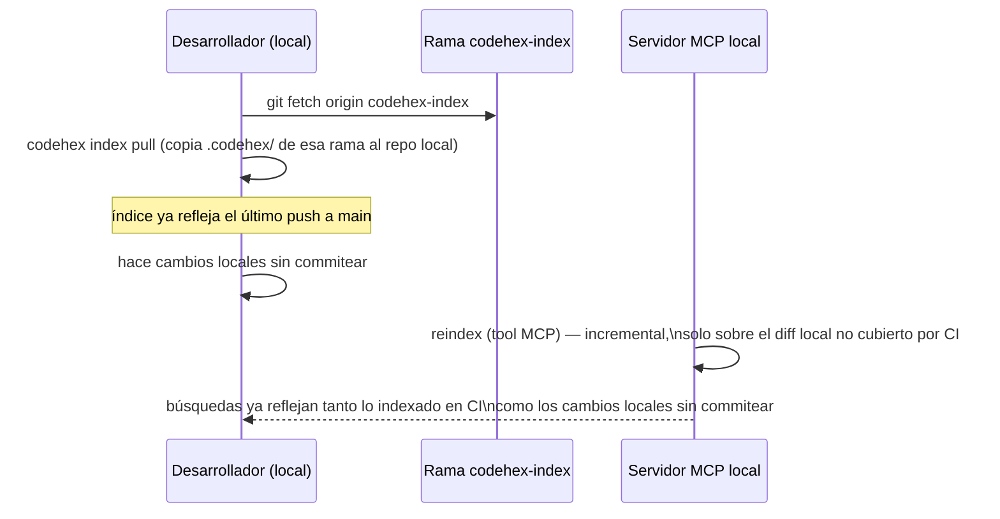

# 10 · GitHub Actions: reindexado automático

## 1. El problema a resolver

El servidor MCP (capítulo 08) corre en la máquina del desarrollador y lee el índice local (`<repo>/.codehex/`). Si ese índice solo se actualiza cuando alguien ejecuta `codehex reindex` a mano, se desactualiza en cuanto alguien más hace push de cambios que el desarrollador local no tiene. GitHub Actions resuelve esto ejecutando el reindexado **en cada cambio relevante al repositorio**, no solo cuando alguien se acuerda.

Esto introduce una pregunta de diseño que no tiene una única respuesta correcta: **si el índice se genera en CI, ¿cómo llega a la máquina del desarrollador donde corre el servidor MCP?**

## 2. Disparadores del workflow

```yaml
on:
  push:
    branches: [main]
  pull_request:
    branches: [main]
  schedule:
    - cron: "0 */6 * * *"   # red de seguridad: reindexado completo cada 6h, por si el incremental se desincroniza
  workflow_dispatch: {}      # disparo manual desde la UI de GitHub o `gh workflow run`
```

- **`push` a `main`**: el caso principal — cada cambio que llega a la rama principal dispara un reindexado incremental.
- **`pull_request`**: opcional, útil si quieres validar que el código de una PR es indexable (el job falla si el parseo rompe) sin publicar el índice resultante todavía.
- **`schedule`**: una red de seguridad periódica — si por lo que sea el incremental se desincronizó (p.ej. un fallo silencioso), un reindexado completo cada cierto tiempo autocorrige.
- **`workflow_dispatch`**: para forzar un reindexado manual sin esperar al próximo push.

## 3. Qué hace el job

```yaml
name: Reindex code-RAG

on:
  push:
    branches: [main]
  workflow_dispatch: {}

jobs:
  reindex:
    runs-on: ubuntu-latest
    permissions:
      contents: write   # necesario solo si el índice se commitea a una rama (opción A, sección 4)
    steps:
      - uses: actions/checkout@v4
        with:
          fetch-depth: 0   # historial completo: el diff incremental (capítulo 07) lo necesita

      - uses: actions/setup-python@v5
        with:
          python-version: "3.12"

      - name: Instalar codehex
        run: pip install codehex

      - name: Restaurar índice previo
        uses: actions/checkout@v4
        with:
          ref: codehex-index
          path: .codehex-previous
        continue-on-error: true   # la primera vez esta rama no existe todavía

      - name: Reindexar incrementalmente
        env:
          VOYAGE_API_KEY: ${{ secrets.VOYAGE_API_KEY }}
        run: |
          [ -d .codehex-previous/.codehex ] && cp -r .codehex-previous/.codehex .codehex
          codehex index --project . --root .

      - name: Publicar índice actualizado
        run: |
          git config user.name "codehex-bot"
          git config user.email "codehex-bot@users.noreply.github.com"
          git checkout -B codehex-index
          git add .codehex
          git commit -m "chore: reindex $(git rev-parse --short HEAD)" || echo "sin cambios"
          git push origin codehex-index --force
```

`fetch-depth: 0` es imprescindible: el algoritmo del capítulo 07 necesita `git diff` contra un commit potencialmente antiguo, y un checkout superficial (`fetch-depth: 1`, el valor por defecto) no tiene ese historial disponible.

## 4. Dónde persistir el índice: opciones y trade-offs

| Opción | Cómo funciona | Ventaja | Coste |
|---|---|---|---|
| **A. Rama dedicada** (usada arriba, p.ej. `codehex-index`) | El job commitea `.codehex/` a una rama separada de `main`, sin mezclarse con el historial de código | Sencillo, versionado, con historial de índices; el desarrollador local puede hacer `git fetch` de esa rama y copiar el índice | La rama crece con cada reindex (mitigable con `--force` sobreescribiendo, como arriba, en vez de acumular commits) |
| **B. Artifact de GitHub Actions** | El job sube `.codehex/` como artifact (`actions/upload-artifact`) | No ensucia el repositorio con una rama extra | Los artifacts expiran (retención configurable, pero no son almacenamiento permanente); requiere `gh run download` o la API para bajarlo localmente — menos directo que un `git pull` |
| **C. Release asset** | El job publica `.codehex/` empaquetado como asset de una GitHub Release | Persistente, versionado por release, fácil de referenciar por tag | Requiere gestionar versiones de release solo para esto — más ceremonia de la necesaria si solo quieres "el índice más reciente" |
| **D. Almacenamiento externo** (bucket S3/GCS, registry de artefactos) | El job sube el índice a un almacén fuera de GitHub | Escala mejor si el índice es grande o si varios repos comparten infraestructura de CI/CD | Añade una dependencia de infraestructura externa y sus credenciales — desproporcionado para un proyecto que se quiere "fácil de levantar" |

**Recomendación de esta guía: opción A (rama dedicada)**, siguiendo exactamente el mismo patrón que ya usa `kairosai` para su propia rama `kairosai` de configuración — es la opción con menos infraestructura nueva (usa git, que ya tienes) y la más simple de sincronizar localmente (`git fetch origin codehex-index`).

## 5. Cómo el servidor MCP local reconcilia CI + cambios locales

El flujo recomendado para el desarrollador:



`codehex index pull` (un comando adicional del CLI, capítulo 11) simplemente copia el contenido de `.codehex/` desde la rama remota al árbol de trabajo local — no requiere fusionar nada porque el índice no es código fuente que edite un humano, es una caché reconstruible. A partir de ahí, la tool `reindex` del servidor MCP hace lo de siempre (capítulo 07): diff incremental, esta vez cubriendo solo los cambios locales que CI todavía no vio.

## 6. Seguridad

- **La clave de API de embeddings vive como GitHub Secret** (`secrets.VOYAGE_API_KEY`), nunca en el workflow ni en el repositorio — se inyecta como variable de entorno solo en el paso que la necesita.
- **Permisos mínimos**: el job solo necesita `contents: write` si publica a una rama (opción A); con las opciones B o C, ni eso — usa `permissions: contents: read` por defecto y añade el mínimo necesario explícitamente, siguiendo el principio de mínimo privilegio.
- **No expongas el workflow a `pull_request_target`** salvo que sepas exactamente por qué — ese evento da acceso a secrets incluso en PRs de forks no confiables, un vector de fuga de la API key si el job ejecuta código del PR.

## Ideas reutilizables de los proyectos existentes

- **De `kairosai`**: la rama dedicada como mecanismo de sincronización (`sync.py`, que empuja `.kairosai/` a una rama `kairosai` vía PR+merge automático) es el precedente directo de la opción A de este capítulo — aquí simplificado a push directo con `--force` porque el índice no necesita revisión humana como sí la necesita la configuración que gestiona kairosai.
- **De `code-rag-mcp`**: ninguna — no tiene automatización de CI, es precisamente la pieza que esta guía añade sobre su base.

## Siguiente paso

[11 · CLI y empaquetado](11-cli-y-empaquetado.md): cómo se distribuye todo esto como una herramienta instalable con un solo comando.
