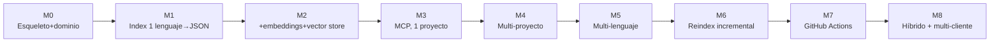

# 12 · Guía paso a paso

Roadmap de construcción en milestones incrementales. Cada uno produce algo que funciona de punta a punta (aunque sea limitado), en vez de construir todas las capas a la vez sin nada ejecutable hasta el final. Este orden está pensado para maximizar la señal temprana: sabrás si una decisión de diseño fue acertada mucho antes de haber invertido en todo el sistema.

## M0 — Esqueleto y dominio

**Qué construir:** el layout de carpetas del capítulo 03, el modelo de dominio (`domain/models.py`) y las interfaces de los puertos (sin ninguna implementación todavía). `pyproject.toml` con el paquete instalable.

**Definición de hecho:** `pip install -e .` funciona; `import codehex.domain.models` funciona; hay al menos un test en `tests/domain/` que pasa sobre una entidad del dominio (aunque sea trivial, confirma que el paquete y pytest están bien conectados).

**Referencia:** capítulo 03.

## M1 — Indexado de un solo lenguaje a JSON plano

**Qué construir:** `TreeSitterPythonParser` (un único lenguaje, no los tres todavía), un `VectorStore` falso o mínimo (puede ser literalmente un fichero JSON con embeddings dummy — vectores aleatorios, sin llamar a ningún modelo real todavía), y el caso de uso `IndexProject` conectándolos. CLI: `codehex index --project <nombre>`.

**Definición de hecho:** ejecutas `codehex index` sobre un repo Python de prueba y obtienes un fichero con chunks (símbolo, ruta, líneas) — sin buscar todavía, solo indexar y poder inspeccionar el resultado a ojo.

**Referencia:** capítulos 03, 05 (solo la parte de Python).

**Por qué este orden:** valida el pipeline de extremo a extremo (descubrir ficheros → parsear → persistir) antes de complicarlo con embeddings reales o múltiples lenguajes. Si algo en el diseño de `CodeChunk` no encaja bien, lo descubres aquí, barato.

## M2 — Embeddings reales + vector store + búsqueda semántica

**Qué construir:** sustituye el `VectorStore` falso de M1 por `LanceDbVectorStore` real, y añade `LocalSentenceTransformerProvider` (modelo ligero, capítulo 06, sección 1) como primer `EmbeddingProvider`. Implementa `SearchCode` (solo la parte semántica por ahora, sin la léxica todavía). CLI: `codehex search "<consulta>" --project <nombre>`.

**Definición de hecho:** una búsqueda por significado (p.ej. "validación de usuario") devuelve una función relevante aunque el nombre literal no coincida con la consulta — esta es la prueba de que la capa semántica aporta algo sobre un simple `grep`.

**Referencia:** capítulo 06.

## M3 — Servidor MCP, un solo proyecto

**Qué construir:** el adaptador `adapters/mcp/server.py` con FastMCP (capítulo 08), exponiendo `search_code` y `get_source` como mínimo. Conéctalo a Claude Code (capítulo 09) apuntando a un único proyecto hardcodeado (todavía sin registro multi-proyecto).

**Definición de hecho:** desde una sesión de Claude Code, el agente invoca `search_code` y `get_source` con éxito sobre tu repo de prueba, y usa el resultado para responder una pregunta real sobre el código.

**Referencia:** capítulos 08, 09 (solo Claude Code por ahora).

**Por qué este orden:** este es el primer milestone "demostrable" — verlo funcionar de verdad desde un cliente real valida que todo lo anterior (M0-M2) tiene la forma correcta para ser consumido por un agente, antes de invertir en más lenguajes o más proyectos.

## M4 — Registro multi-proyecto

**Qué construir:** `YamlProjectRegistry`, los comandos `codehex project add/list/remove`, y añade `project_id` como parámetro obligatorio a todas las tools MCP (capítulo 04). Añade `list_projects` como tool nueva.

**Definición de hecho:** dos proyectos registrados y consultables de forma completamente independiente desde el mismo servidor MCP, sin resultados cruzados entre ellos.

**Referencia:** capítulo 04.

## M5 — Multi-lenguaje

**Qué construir:** `TreeSitterJavaScriptParser`, `TreeSitterJavaParser` y `GenericTextParser` como fallback (capítulo 05), conectados vía `CompositeLanguageParser`.

**Definición de hecho:** un proyecto con ficheros Python, JS y Java a la vez se indexa correctamente, con chunks del lenguaje correcto para cada fichero, sin tocar ninguna línea de `IndexProject` ni del dominio (si tocaste algo fuera de `adapters/parsers/`, algo en el diseño de puertos no está bien aislado — retrocede antes de seguir).

**Referencia:** capítulo 05.

## M6 — Reindexado incremental

**Qué construir:** `GitCliProvider` y `ReindexProject` (capítulo 07), sustituyendo `reindex` de "siempre completo" a "incremental cuando hay índice previo".

**Definición de hecho:** modificas un solo fichero de un repo ya indexado, ejecutas `reindex`, y el tiempo de ejecución es notablemente menor que un `index` completo del mismo repo — y los resultados de búsqueda reflejan el cambio.

**Referencia:** capítulo 07.

## M7 — GitHub Actions

**Qué construir:** el workflow del capítulo 10, publicando el índice a una rama dedicada, más el comando `codehex index pull`.

**Definición de hecho:** haces push a `main` en un repo de prueba, el workflow corre y publica un índice actualizado en la rama dedicada, y `codehex index pull` en local lo trae sin errores.

**Referencia:** capítulo 10.

## M8 — Retrieval híbrido + instaladores multi-cliente

**Qué construir:** la capa léxica de `SearchCode` (capítulo 06, sección 3) combinada con la semántica; `codehex mcp install --client claude|codex|copilot` (capítulo 09, sección 5); clasificación opcional de capa/rol si tu caso de uso lo justifica (capítulo 05, sección 5).

**Definición de hecho:** una búsqueda por un símbolo exacto (p.ej. el nombre literal de una excepción) y una búsqueda puramente conceptual devuelven ambas buenos resultados desde el mismo `search_code`; los tres clientes (Claude Code, Codex CLI, Copilot CLI) quedan configurados con un solo comando cada uno.

**Referencia:** capítulos 06, 09.

## Resumen visual

No es obligatorio seguir el orden exacto — por ejemplo, M5 (multi-lenguaje) y M6 (incremental) son independientes entre sí y se podrían intercambiar. Lo que sí conviene respetar es la dependencia de fondo: M0-M2 antes que nada (sin dominio ni pipeline básico no hay sobre qué construir), y M3 antes de invertir en M4-M8 (validar contra un cliente real pronto evita descubrir tarde que el tool surface no encaja con cómo un agente realmente los usa).

## Siguiente paso

[13 · Glosario y referencias](13-glosario-y-referencias.md), como consulta puntual mientras construyes.
