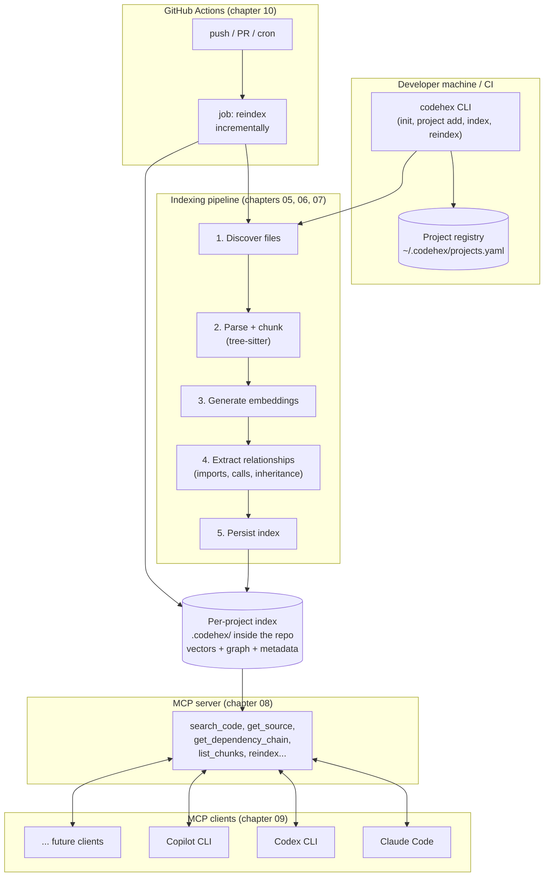

# 00 · Overview

## What you're going to build

A system, `codehex`, with three parts that run at different times but share the same index:

1. **An indexer** that walks a code repository, splits it into meaningful units (functions, classes, methods), generates a vector representation (embedding) and a structural one (dependency graph) for each, and persists it to disk.
2. **An MCP server** that, given that already-built index, answers questions from an LLM agent ("where is the user's email validated?", "what implements this interface?", "show me the code for this function") without the agent having to read the entire repository.
3. **An automatic trigger** (GitHub Actions) that runs the indexer every time the code changes, so the index is never more than a few minutes out of date.

All of this for **several projects at once** — not an index hardcoded to a single repo, but a project registry you can add to, remove from, and query independently.

## The full map

## The four questions each chapter answers

Before going into detail, it's worth being clear about **what problem each piece solves**, because it's easy to get lost in the technical details and lose sight of the why:

| Piece | Question it answers | Chapter |
|---|---|---|
| Structural chunking | "How do I chunk code without splitting a function in half?" | 02, 05 |
| Embeddings + vector store | "How do I find relevant code by *meaning*, not just exact text?" | 01, 06 |
| Dependency graph | "How do I know what depends on what, without an LLM having to infer it by reading 50 files?" | 02, 03 |
| Hexagonal architecture | "How do I avoid adding Java or switching vector stores forcing me to rewrite everything?" | 03 |
| Multi-project registry | "How do I index and query 10 different repos without 10 different installations?" | 04 |
| Incremental indexing | "How do I reindex a 500k-line repo in seconds, not minutes, after a small change?" | 07 |
| MCP server | "How do I talk to this index from an LLM agent in a standard way?" | 08 |
| Client integration | "How does Claude Code / Codex / Copilot find out this server exists?" | 09 |
| GitHub Actions | "How do I avoid having to remember to reindex by hand?" | 10 |

## What this system is NOT

- **It is not a chatbot or an agent**: it does not generate answers on its own. It is retrieval infrastructure — the LLM (Claude, GPT, etc.) is still the one that reasons and answers; `codehex` just gives it efficient access to the relevant code.
- **It does not replace `git grep` for everything**: for an exact, one-off text search, `grep`/`ripgrep` is still faster. `codehex` adds value when the search is semantic ("code that validates credit cards") or when you want to navigate structural relationships without reading file by file.
- **It does not require deep understanding of embedding mathematics**: they're used as a black box with one specific, sufficient property (chapter 01): things with similar meaning end up close together in vector space. That's enough to design the system.

## Where to go from here

Continue with [01 · RAG fundamentals](01-fundamentos-rag.md) if you need to solidify the base concepts, or jump to [03 · Hexagonal architecture](03-arquitectura-hexagonal.md) if you already master them and want to go straight to the design.
