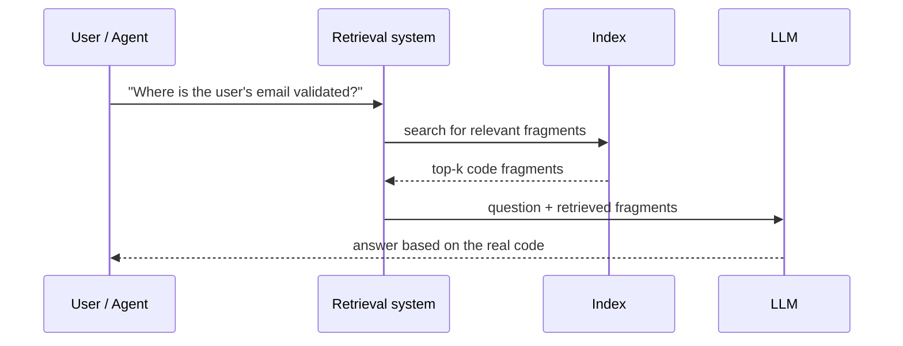
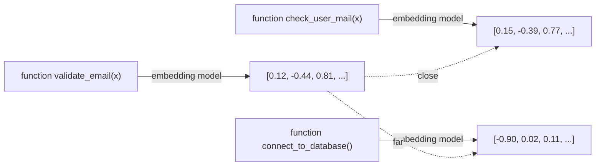

# 01 · RAG fundamentals

This chapter assumes you know what an LLM is (a model that predicts text given a context) but haven't gone into the detail of how a real retrieval system is built. If you already know embeddings, cosine similarity, and chunking in depth, you can skip to [02](02-code-rag-particularidades.md).

## 1. Why RAG exists

An LLM only "knows" two things: what it learned during training (frozen at a given date) and what you put into the conversation's context (the prompt). It knows nothing about your private repository, and even if it did, a large repository doesn't fit entirely in a context window — and even if it did fit, sending it whole with every question would be slow and expensive.

**RAG (Retrieval-Augmented Generation)** solves this with a simple idea: instead of the model "knowing" your code from memory, you give it a way to **search** for the relevant fragment and put it into the context right before answering. The name says it all: *Retrieval* (retrieving what's relevant) + *Augmented Generation* (text generation, but augmented with that retrieved information).

Note something important: **the LLM never "contains" your code**. It only sees it at the moment of answering, just like you open a file to read it before answering a question about it. This is key to understanding what gets persisted (section 4).

## 2. Embeddings: the core ingredient

An **embedding** is a vector of numbers (for example, 768 or 1536 decimal numbers) that represents the *meaning* of a piece of text. It's generated by passing the text through a model trained for this purpose (an "embedding model", different from the LLM that generates text).

The property that makes it useful, and the only one you need to design the system, is:

> **Texts with similar meaning produce vectors that are close to each other in that number space.**

"Close" is usually measured with **cosine similarity**: the cosine of the angle between two vectors. It's 1 if they point in exactly the same direction (maximum similarity), 0 if they're perpendicular (no relation), and -1 if they're opposite. You don't need the formula to design the system — you just need to know it's a number between -1 and 1 that a vector store computes for you when searching.

Even though `validate_email` and `check_user_mail` don't share a single literal word, the embedding model places them close together because they *mean* something similar. This is what makes the search **semantic** rather than just textual — the key difference versus a `grep`.

## 3. Chunking: what unit gets indexed

You don't feed an entire repository into an embedding model at once — the result would be an overly generic vector ("this is a software repository", with no nuance). Instead, you split it into **chunks**: smaller units, each with its own embedding.

How you decide where to cut is a design decision with a direct impact on search quality — so much so that [chapter 02](02-code-rag-particularidades.md) is dedicated exclusively to this for the case of code. For now, keep the general idea: a chunk that's too large dilutes the meaning (the embedding becomes an "average" of many different things); one that's too small loses context (a lone line without the function around it says very little).

## 4. What actually gets persisted — the key question

This is probably the question that causes the most confusion when first getting into RAG, and the one this guide's reader specifically wanted to be clear on before designing anything. The short answer:

> **"Knowledge" is not persisted. What's persisted is vectors + metadata + a pointer to the original content.**

Broken down, for each chunk you typically store:

| Field | What it is | Example |
|---|---|---|
| **Embedding** | The numeric vector computed from the chunk's text | `[0.12, -0.44, 0.81, ...]` (768 floats) |
| **Chunk text (or pointer)** | The actual content, or a reference to where to read it | the function's source code, or `file.py:40-58` |
| **Metadata** | Structured data about the chunk, used for filtering and displaying results | language, function/class name, file path, indexed commit hash |

What is **not** persisted or transformed is the code itself — the vector is not a reversible compression of the text (you can't reconstruct the code from the embedding). That's why almost every serious code-RAG system **also** stores the text, or at least the exact path+lines: the embedding is only good for *finding*, not for *displaying*. When the LLM needs to see the actual code, it's read from the file (or the stored text), not from the vector.

This has an important design implication that comes up in [chapter 06](06-embeddings-vector-store.md): **the vector store does not replace version control**. It stores a copy of the text (or simply the path and line range, reconstructible as long as the repo doesn't change incompatibly) alongside the vector, so it can return real content, not just a similarity number.

## 5. Vector store: where this lives

A **vector store** (or "vector database") is a store specialized in holding many vectors and efficiently answering the question "which k vectors are closest to this query vector?" (**k-NN**, k-nearest-neighbors, approximated in practice so it scales — **ANN**, approximate nearest neighbors).

It's not fundamentally different from a relational database in its role: it stores data and lets you query it. The difference is the type of query it optimizes for (vector similarity instead of equality/range over columns), and for this project it's explored in detail in chapter 06, including why an **embedded** one (no external server to run) makes sense for a local code-RAG manager.

## 6. Lexical vs. semantic vs. hybrid retrieval

| Type | How it searches | Strong at | Weak at |
|---|---|---|---|
| **Lexical** (keyword / full-text) | Word/substring matching, with BM25-style or ad-hoc scoring | Exact symbols: exception names, function names, variable names | Synonyms, paraphrasing, "find something that does X" without knowing the exact name |
| **Semantic** (embeddings) | Vector similarity | Conceptual questions, code with different names but similar function | Exact precision for an uncommon identifier; may bring back "almost the same thing" when you wanted *exactly that* |
| **Hybrid** | Combines both (and sometimes structural signals) | The best of both worlds | More pieces to maintain |

For code, established practice (and the one this guide follows, see chapter 02) is **hybrid**: neither lexical alone nor semantic alone is enough, because code has exact identifiers that matter (exception names, endpoint names) *and* meaning relationships that a `grep` doesn't capture.

## 7. How to measure whether a RAG works well

You don't need to dive deep into evaluation math to design the system, but it's worth knowing the minimum vocabulary:

- **top-k**: how many results a search returns (e.g., "the 10 most relevant chunks").
- **recall@k**: of all the chunks that are actually relevant to a query, what fraction appears among the first k results? If the correct answer is in chunk 15 and you ask for top-10, your recall@10 for that query is 0.
- **precision**: of the k results returned, how many are actually relevant? High precision and low recall = correct but incomplete results. High recall and low precision = you find it, but surrounded by noise.

These metrics matter when you tune the default `limit`/`top_k` of your MCP tools (chapter 08) or when you decide whether hybrid retrieval is working better than semantic alone — but they're not a blocker for starting to build.

## Reusable ideas from existing projects

Neither of the two sibling projects (`kairosai`, `code-rag-mcp`) implements embeddings or a vector store — this chapter is new ground. But `code-rag-mcp` does demonstrate, in practice, the "lexical" half of the table in section 6: its `search_code` scores text matches (class name, methods, exceptions) with no semantic component at all. It's a good example of how far lexical retrieval alone gets you — and of why, in chapter 02, it's proposed to add the semantic half rather than replace it.

## Next step

[02 · Code-RAG particulars](02-code-rag-particularidades.md): why applying RAG to code is not the same as applying it to text documents.
