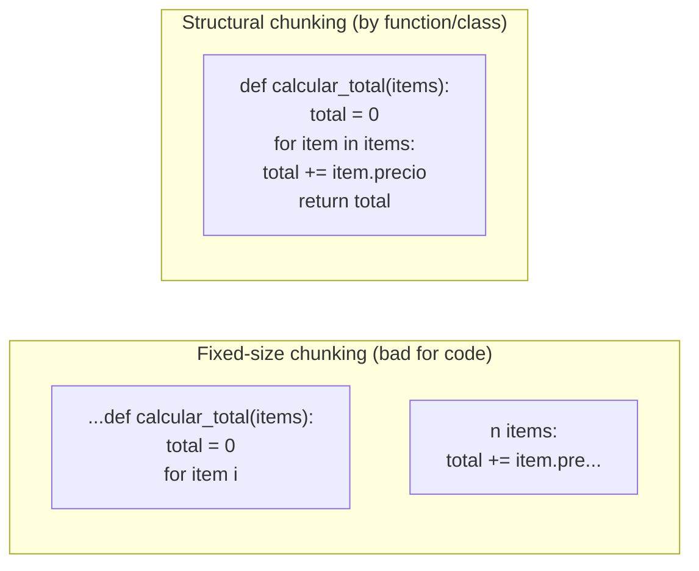

# 02 · Code-RAG particulars

A RAG over documentation or articles and a RAG over code share the fundamentals from chapter 01, but code has properties that a generic "chunk and vectorize" system ignores, and that need to be designed for explicitly.

## 1. Code is not prose

If you apply fixed-size chunking (e.g., "chunk every 500 characters with 50 characters of overlap") to a code file, you'll end up splitting functions in half, separating a signature from its body, or mixing the end of one class with the start of the next. The embedding produced from such a chunk represents a syntactically incomplete fragment — it "means" worse than if it respected the language's boundaries.

The alternative, and the one this guide uses, is **structural chunking**: cutting at the boundaries the language itself already defines — function, method, class, interface — using a real parser instead of counting characters. [Chapter 05](05-parsing-multilenguaje.md) covers how to do this with tree-sitter for several languages.



## 2. Code has explicit relationships that an embedding doesn't capture well

An embedding answers "what resembles this in meaning?" well. It answers poorly to questions like:

- "Which classes implement this interface?"
- "What happens to this endpoint if I drop this table?"
- "Who calls this function?"

These are questions about **structure**, not meaning — and the code already contains that structure explicitly and perfectly extractably: imports, `implements`/`extends`, function calls, foreign keys in SQL. Ignoring this and relying only on semantic similarity is throwing away free information.

That's why this guide's design isn't plain "RAG with embeddings", but a **three-layer hybrid index**:

| Layer | What it answers | How it's built |
|---|---|---|
| **Semantic** (embeddings) | "Find me code that does something similar to X" | Embedding model over each chunk (chapter 06) |
| **Lexical** (keywords) | "Find me the exact symbol `PRODUCT_SKU_ALREADY_EXISTS`" | Text-match scoring over the chunk's name/metadata |
| **Structural** (graph) | "What implements this? What depends on this?" | Graph of directed edges extracted by the parser (implements, extends, call, FK) |

None of the three replaces the other two. They're combined at query time (chapter 08): a normal search uses semantic+lexical with combined scoring, and a navigation question uses the graph with a BFS/DFS traversal over the edges.

## 3. Case study: `code-rag-mcp`, the "no embeddings" half already solved

The sibling project `code-rag-mcp` (in this same `ai/` folder) is a real, working example of the lexical + structural layers, without the semantic layer. It's worth looking at as a reference because it already validated, on a real Java project, two pieces that this guide reuses conceptually:

**Data model.** Each indexed unit (`CodeChunk`) stores identity (fully-qualified name, module), classification (architectural layer, role — `entity`, `port-in`, `adapter`, `controller`...), structure (fields, methods with signature and calls, `implements`/`extends`) and a rule-generated text summary. Relationships (`DependencyEdge`) are typed edges (`IMPLEMENTS`, `EXTENDS`, `FIELD_INJECTION`, `FOREIGN_KEY`, `IMPORT`) between chunks. This is, almost literally, the domain model proposed in [chapter 03](03-arquitectura-hexagonal.md) — it's just missing the `embedding` field.

**In-memory graph for navigation.** On startup, it builds maps (`chunksByFqcn`, `outEdges`/`inEdges` as adjacency lists, `reverseDeps`) that let it answer "who depends on X?" in O(1) and traverse the graph with BFS in O(V+E) — no graph database, all in memory from a JSON file. For the code volume of a typical repository (thousands, not millions, of symbols), this is more than enough and avoids adding infrastructure.

What it lacks, and what this guide does cover, is exactly the semantic layer (embeddings + vector store, chapter 06), real multi-language support (chapter 05), multi-project support (chapter 04), and automation via CI (chapter 10).

## 4. What gets persisted, specifically, for code

Picking back up the question from chapter 01 ("what actually gets stored?"), for a code chunk the typical full record includes:

```
CodeChunk
├── id                    # stable identifier (e.g., hash of fqcn+path)
├── embedding             # vector, semantic layer
├── text / pointer        # chunk's source code, or (path, start_line, end_line)
├── language              # python | javascript | java | ...
├── symbol                # function/class/method name
├── file_path
├── indexed_commit_hash   # to know if it's still current (chapter 07)
└── metadata              # signature, docstring/comment, layer/role if classified (optional)

DependencyEdge
├── source   (chunk id)
├── target   (chunk id)
└── type     # IMPORTS | CALLS | IMPLEMENTS | EXTENDS | FOREIGN_KEY | ...
```

Neither the embedding nor the graph replaces the git repository — they remain an index layer *derived* from the code, reconstructible from it at any time. This is intentional: it means the index can be deleted and regenerated without any real loss of information, which greatly simplifies the design (there's no migration of "irreplaceable" data, just a rebuildable cache).

## 5. Optional enrichment: layer/role classification

`code-rag-mcp` also classifies each chunk by architectural layer (`domain`, `application`, `infrastructure`...) and role (`entity`, `port-in`, `adapter`, `controller`...) using heuristics over the package and annotations (e.g., something in a `...domain...` package that is an interface with no annotations is probably a *port*; something annotated `@RestController` is a *controller*).

This is **valuable but optional** — it's not part of a code-RAG's core, it's an enrichment on top of the base model that improves filtering (`search_code { layer: "domain" }`) when the code follows a recognizable architectural convention (hexagonal, layered, Spring/FastAPI with decorators). If your first indexed project doesn't follow any clear convention, skip it without worry — the system works just the same without this layer, you just lose one extra filter. It's revisited as an optional extension in chapter 05.

## Reusable ideas from existing projects

- **From `code-rag-mcp`**: the `CodeChunk`/`DependencyEdge` model as the basis for the domain model (chapter 03); the in-memory map pattern (`chunksByFqcn`, adjacency lists) for graph navigation without extra infrastructure; the pure layer/role classifiers as optional enrichment (chapter 05); the incremental reindexing algorithm via `git diff` (chapter 07).
- **From `kairosai`**: nothing code-RAG-specific — its contribution comes in chapter 04 (multi-project management).

## Next step

[03 · Hexagonal architecture](03-arquitectura-hexagonal.md): how to organize all of this — parser, embeddings, vector store, graph, MCP — so each piece can be swapped out without touching the others.
