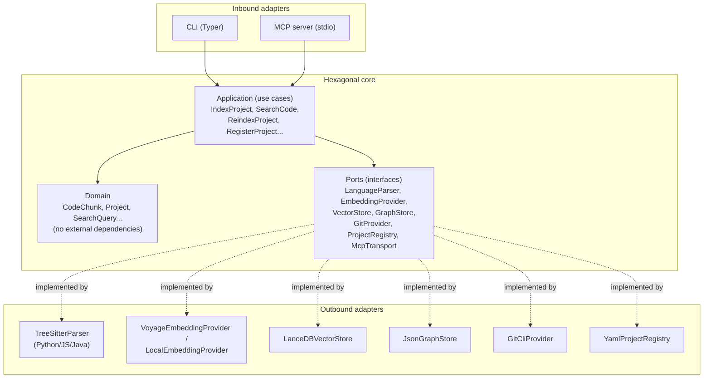

# 03 · Hexagonal architecture

This is the central chapter of the guide: the architectural decision that turns everything else (multi-language, multi-project, multi MCP client, different vector stores) into "add an adapter" instead of "rewrite the core".

## 1. The idea, without jargon

A hexagonal system separates two things that almost always get mixed together for convenience:

- **The domain**: the rules and concepts specific to your problem — what a `CodeChunk` is, what "indexing a project" means, how relevance is compared. It knows nothing about tree-sitter, OpenAI, LanceDB, or JSON-RPC. It's plain Python, with no external infrastructure dependencies.
- **The infrastructure**: the concrete tools you use today to fulfill those rules — tree-sitter for parsing, a specific embedding model, a specific vector store, stdio to speak MCP. These pieces **change over time** (today you use tree-sitter, tomorrow maybe a different parser; today you use a local embedding model, tomorrow a paid one).

Hexagonal architecture says: the domain defines **ports** (interfaces — "I need something that knows how to parse code and give me chunks back", without saying how). The infrastructure implements those ports with concrete **adapters** (`TreeSitterPythonParser`, `VoyageEmbeddingProvider`...). The domain never imports an adapter directly — it only knows the port.



The dependency rule is always **inward**: adapters know about the domain (through the ports), the domain never knows about the adapters. This is what lets you, later on, write a `JavaScriptParser` without touching a single line of `IndexProject`, or swap LanceDB for Qdrant without touching `SearchCode`.

## 2. Why it's worth it here specifically (and it's not over-engineering)

With hexagonal architecture you always have to ask whether the cost of the indirection pays off. In this project, it does, for one very concrete reason: **the project's own requirements call for 4 independent axes of variation**:

1. Language of the indexed code (Python, JS, Java, future ones) → varies the `LanguageParser`.
2. Embedding provider (local vs. API, and which one) → varies the `EmbeddingProvider`.
3. Vector store (LanceDB, Chroma, Qdrant...) → varies the `VectorStore`.
4. MCP client (Claude Code, Codex CLI, Copilot CLI, future ones) → this actually doesn't vary the `McpTransport` (they all speak the same MCP protocol), but if tomorrow you add a non-stdio transport (HTTP) that would indeed be a new adapter.

When you already know upfront that there are several axes of variation (not hypothetical: they're in the brief), separating ports from adapters isn't speculation — it's the cheapest way of making point 5 (adding Go, say, a year from now) trivial.

## 3. Domain model

Entities (following the example from chapter 02, with the `embedding` field that `code-rag-mcp` didn't have):

```python
# domain/models.py — no infrastructure imports, just dataclasses/types

from dataclasses import dataclass, field
from enum import Enum

class EdgeType(str, Enum):
    IMPORTS = "imports"
    CALLS = "calls"
    IMPLEMENTS = "implements"
    EXTENDS = "extends"
    FOREIGN_KEY = "foreign_key"

@dataclass(frozen=True)
class CodeChunk:
    id: str                      # stable hash (path + symbol + line range)
    project_id: str
    language: str                 # "python" | "javascript" | "java" | ...
    symbol: str                   # function/class/method name
    kind: str                     # "function" | "class" | "method" | "interface" | ...
    file_path: str
    start_line: int
    end_line: int
    source_text: str
    embedding: list[float] | None = None
    metadata: dict = field(default_factory=dict)   # signature, docstring, optional layer/role

@dataclass(frozen=True)
class DependencyEdge:
    source_chunk_id: str
    target_chunk_id: str
    edge_type: EdgeType

@dataclass(frozen=True)
class Project:
    id: str
    name: str
    root_path: str
    languages: list[str]
    last_indexed_commit: str | None = None
    last_indexed_at: str | None = None

@dataclass(frozen=True)
class SearchQuery:
    project_id: str
    text: str
    top_k: int = 10
    language: str | None = None
    kind: str | None = None

@dataclass(frozen=True)
class SearchResult:
    chunk: CodeChunk
    score: float
    match_reason: str            # "semantic" | "lexical" | "hybrid"
```

All of the above is standard Python — it can be tested with `pytest` without spinning up any external service, without complex mocks. That's the signal that the domain is well isolated.

## 4. Ports

Each port is an interface (in Python, a `Protocol` or an abstract base class) that the domain needs and the infrastructure implements:

| Port | Responsibility | Reference adapters (chapters) |
|---|---|---|
| `LanguageParser` | Given a source file, return `CodeChunk`s + `DependencyEdge`s | `TreeSitterPythonParser`, `TreeSitterJavaScriptParser`, `TreeSitterJavaParser`, `GenericTextParser` (fallback) — ch. 05 |
| `EmbeddingProvider` | Given a text, return its vector | `VoyageEmbeddingProvider`, `LocalSentenceTransformerProvider` — ch. 06 |
| `VectorStore` | Persist vectors + metadata; search for the k nearest | `LanceDbVectorStore`, `ChromaVectorStore` — ch. 06 |
| `GraphStore` | Persist and query `DependencyEdge`s; BFS/DFS traversal | `JsonGraphStore` (in-memory + file) — ch. 02, 07 |
| `GitProvider` | Diff between commits, working tree state | `GitCliProvider` (subprocess over `git`) — ch. 07 |
| `ProjectRegistry` | Add/remove/list managed projects | `YamlProjectRegistry` — ch. 04 |
| `McpTransport` | Receive/send JSON-RPC messages for the MCP protocol | `StdioMcpTransport` (via official SDK) — ch. 08 |

Example of a port in code:

```python
# ports/language_parser.py
from typing import Protocol
from domain.models import CodeChunk, DependencyEdge

class LanguageParser(Protocol):
    def supports(self, file_path: str) -> bool: ...

    def parse(self, project_id: str, file_path: str, source: str) -> tuple[list[CodeChunk], list[DependencyEdge]]: ...
```

```python
# ports/embedding_provider.py
from typing import Protocol

class EmbeddingProvider(Protocol):
    def embed_batch(self, texts: list[str]) -> list[list[float]]: ...
```

```python
# ports/vector_store.py
from typing import Protocol
from domain.models import CodeChunk, SearchResult

class VectorStore(Protocol):
    def upsert(self, project_id: str, chunks: list[CodeChunk]) -> None: ...
    def delete(self, project_id: str, chunk_ids: list[str]) -> None: ...
    def search(self, project_id: str, query_embedding: list[float], top_k: int) -> list[SearchResult]: ...
```

Notice the `project_id` in every method of `VectorStore` and `GraphStore` — it's the seam where chapter 04's multi-project design fits in: every operation is always scoped to a project (namespace/collection), never "global".

## 5. Use cases (application layer)

Use cases orchestrate ports to fulfill a complete business operation. They live in `application/`, depend on the ports (never on concrete adapters), and are injected through the constructor:

```python
# application/index_project.py
class IndexProject:
    def __init__(self, parser: LanguageParser, embedder: EmbeddingProvider,
                 vector_store: VectorStore, graph_store: GraphStore,
                 registry: ProjectRegistry, git: GitProvider):
        self._parser = parser
        self._embedder = embedder
        self._vector_store = vector_store
        self._graph_store = graph_store
        self._registry = registry
        self._git = git

    def execute(self, project_id: str) -> IndexStats:
        project = self._registry.get(project_id)
        chunks, edges = [], []
        for file_path, source in discover_files(project.root_path):
            if not self._parser.supports(file_path):
                continue
            file_chunks, file_edges = self._parser.parse(project_id, file_path, source)
            chunks.extend(file_chunks)
            edges.extend(file_edges)

        embeddings = self._embedder.embed_batch([c.source_text for c in chunks])
        chunks = [replace(c, embedding=e) for c, e in zip(chunks, embeddings)]

        self._vector_store.upsert(project_id, chunks)
        self._graph_store.upsert_edges(project_id, edges)
        self._registry.mark_indexed(project_id, commit=self._git.head(project.root_path))
        return IndexStats(total_chunks=len(chunks), total_edges=len(edges))
```

Main use cases you'll need (one per file in `application/`, one-to-one with the MCP tools from chapter 08):

- `RegisterProject` / `ListProjects` / `RemoveProject` (chapter 04)
- `IndexProject` (full, above) / `ReindexProject` (incremental, chapter 07)
- `SearchCode` (hybrid semantic+lexical, chapter 06)
- `GetDependencyChain` (BFS over `GraphStore`, chapter 02)
- `GetSource` (reads the chunk's text/pointer)
- `ListChunks` / `GetIndexStats`

## 6. Adapters

Adapters live in `adapters/<name>/`, freely import external libraries (tree-sitter, your embedding provider's SDK, your vector store's client) and are the **only** layer that knows those libraries exist. They implement a port and nothing more — they contain no business logic.

```python
# adapters/parsers/tree_sitter_python.py
import tree_sitter_python as tspython
from tree_sitter import Language, Parser
from ports.language_parser import LanguageParser
from domain.models import CodeChunk, DependencyEdge

class TreeSitterPythonParser(LanguageParser):
    def __init__(self):
        self._parser = Parser(Language(tspython.language()))

    def supports(self, file_path: str) -> bool:
        return file_path.endswith(".py")

    def parse(self, project_id, file_path, source):
        tree = self._parser.parse(source.encode())
        # walk the tree, extract function_definition / class_definition nodes
        # (full detail in chapter 05)
        ...
```

Each inbound adapter (CLI, MCP server) builds the full dependency graph (choosing which outbound adapter to use for each port, based on configuration) and injects it into the use cases — typically in a small composition module (`composition_root.py` or `container.py`), the only place in the project where the "wires get connected":

```python
# composition_root.py
def build_index_project_use_case(config: ProjectConfig) -> IndexProject:
    parser = CompositeLanguageParser([
        TreeSitterPythonParser(), TreeSitterJavaScriptParser(),
        TreeSitterJavaParser(), GenericTextParser(),   # fallback, always last
    ])
    embedder = build_embedding_provider(config.embedding)   # local or API, per config
    vector_store = LanceDbVectorStore(config.index_dir)
    graph_store = JsonGraphStore(config.index_dir)
    registry = YamlProjectRegistry(config.registry_path)
    git = GitCliProvider()
    return IndexProject(parser, embedder, vector_store, graph_store, registry, git)
```

## 7. Proposed folder layout

```
codehex/
├── pyproject.toml
├── src/codehex/
│   ├── domain/
│   │   └── models.py              # entities, no external dependencies
│   ├── ports/
│   │   ├── language_parser.py
│   │   ├── embedding_provider.py
│   │   ├── vector_store.py
│   │   ├── graph_store.py
│   │   ├── git_provider.py
│   │   └── project_registry.py
│   ├── application/
│   │   ├── index_project.py
│   │   ├── reindex_project.py
│   │   ├── search_code.py
│   │   ├── get_dependency_chain.py
│   │   ├── register_project.py
│   │   └── ...
│   ├── adapters/
│   │   ├── parsers/
│   │   │   ├── tree_sitter_python.py
│   │   │   ├── tree_sitter_javascript.py
│   │   │   ├── tree_sitter_java.py
│   │   │   └── generic_text.py
│   │   ├── embeddings/
│   │   │   ├── voyage_provider.py
│   │   │   └── local_provider.py
│   │   ├── storage/
│   │   │   ├── lancedb_vector_store.py
│   │   │   └── json_graph_store.py
│   │   ├── git/git_cli_provider.py
│   │   ├── registry/yaml_project_registry.py
│   │   ├── cli/                   # inbound adapter: Typer commands
│   │   └── mcp/                   # inbound adapter: stdio MCP server
│   └── composition_root.py
└── tests/
    ├── domain/          # pure tests, no mocks
    ├── application/     # tests with test doubles for the ports
    └── adapters/        # integration tests per adapter
```

This layout is a direct evolution of the layout already seen in `code-rag-mcp` (`model/`, `extractor/`, `search/`, `mcp/`) — except there's no explicit `ports/` layer there (everything is instantiated directly), which is the limitation this chapter fixes.

## Reusable ideas from existing projects

- **From `code-rag-mcp`**: the data model as immutable records (here, `@dataclass(frozen=True)`); the conceptual extractor/model/search split, formalized here as adapter/domain/application via explicit ports.
- **From `kairosai`**: the read/write split (`config.py` vs `mutations.py`) is, in spirit, the same idea as separating `ListProjects` (read) from `RegisterProject` (write) as independent use cases instead of a single "manager" with everything mixed together.

## Next step

[04 · Multi-project design](04-diseno-multi-proyecto.md): how the `ProjectRegistry` fits in to manage several repos from a single installation.
