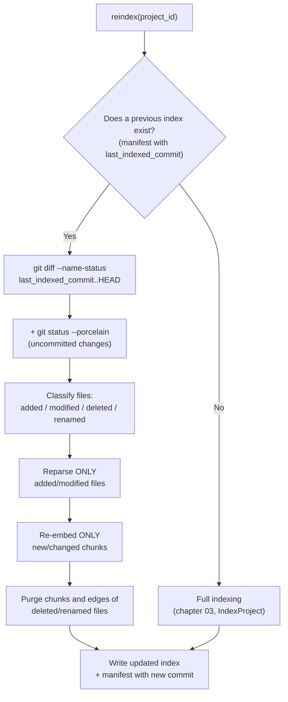

# 07 · Incremental indexing

## 1. Why it matters

Without incremental reindexing, every change (even to a single file) would force: reparsing the entire repository, regenerating all embeddings (cost and time proportional to the total size, not to the change), and rebuilding the whole graph. For a moderately sized repository this can take minutes — unacceptable if you want to reindex on every push (chapter 10) or if an agent calls `reindex` after making a change and expects a fast response.

The solution, already validated in production by `code-rag-mcp` for the Java-only case, is **`git diff`-based reindexing**: the source of truth for "what changed" is not a scan of file timestamps (unreliable: a `git checkout` can touch timestamps without changing content), but the comparison between the commit indexed last time and the current commit (or working-tree state).

## 2. The algorithm



Key points of the algorithm, with the reasoning behind each one:

1. **No previous index → full indexing.** Base case, no surprises.
2. **With a previous index → diff against the stored commit**, not against "the commit before HEAD" — because several commits may have happened since the last time it was indexed (e.g. CI from chapter 10 didn't run for a while, or the user reindexed manually days ago).
3. **Also include the working tree** (`git status --porcelain`), not just commits — otherwise, uncommitted local changes would remain invisible to the index, which breaks the usefulness of on-demand `reindex` while developing.
4. **Prune, don't just add.** A deleted or renamed file leaves orphaned chunks in the vector store and edges pointing to a `chunk_id` that no longer exists — these must be explicitly deleted, otherwise the index accumulates garbage indefinitely (and in the case of edges, `get_dependency_chain` could return broken references).

## 3. Implementation

```python
# ports/git_provider.py
from typing import Protocol

class FileChange(NamedTuple):
    path: str
    status: str   # "added" | "modified" | "deleted" | "renamed"
    old_path: str | None = None

class GitProvider(Protocol):
    def head(self, repo_path: str) -> str: ...
    def diff_since(self, repo_path: str, since_commit: str) -> list[FileChange]: ...
    def working_tree_changes(self, repo_path: str) -> list[FileChange]: ...
```

```python
# adapters/git/git_cli_provider.py
import subprocess

class GitCliProvider:
    def head(self, repo_path: str) -> str:
        return self._run(repo_path, ["rev-parse", "HEAD"]).strip()

    def diff_since(self, repo_path: str, since_commit: str) -> list[FileChange]:
        out = self._run(repo_path, ["diff", "--name-status", since_commit, "HEAD"])
        return self._parse_name_status(out)

    def working_tree_changes(self, repo_path: str) -> list[FileChange]:
        out = self._run(repo_path, ["status", "--porcelain"])
        return self._parse_porcelain(out)

    def _run(self, repo_path: str, args: list[str]) -> str:
        result = subprocess.run(["git", "-C", repo_path, *args],
                                 capture_output=True, text=True, check=True)
        return result.stdout
```

```python
# application/reindex_project.py
class ReindexProject:
    def __init__(self, parser, embedder, vector_store, graph_store, registry, git):
        self._parser, self._embedder = parser, embedder
        self._vector_store, self._graph_store = vector_store, graph_store
        self._registry, self._git = registry, git

    def execute(self, project_id: str) -> IndexStats:
        project = self._registry.get(project_id)

        if project.last_indexed_commit is None:
            return self._index_project.execute(project_id)   # delegates to full indexing

        changes = self._git.diff_since(project.root_path, project.last_indexed_commit)
        changes += self._git.working_tree_changes(project.root_path)

        to_reparse = [c.path for c in changes if c.status in ("added", "modified")]
        to_remove = [c.old_path or c.path for c in changes if c.status in ("deleted", "renamed")]

        removed_chunk_ids = self._graph_store.chunk_ids_for_files(project_id, to_remove)
        self._vector_store.delete(project_id, removed_chunk_ids)
        self._graph_store.remove_files(project_id, to_remove)

        new_chunks, new_edges = [], []
        for path in to_reparse:
            source = read_file(project.root_path, path)
            chunks, edges = self._parser.parse(project_id, path, source)
            new_chunks.extend(chunks)
            new_edges.extend(edges)

        embeddings = self._embedder.embed_batch([c.source_text for c in new_chunks])
        new_chunks = [replace(c, embedding=e) for c, e in zip(new_chunks, embeddings)]

        self._vector_store.upsert(project_id, new_chunks)
        self._graph_store.upsert_edges(project_id, new_edges)
        self._graph_store.prune_dangling_edges(project_id)   # edges that pointed to deleted chunks
        self._registry.mark_indexed(project_id, commit=self._git.head(project.root_path))

        return IndexStats(reparsed=len(to_reparse), removed=len(to_remove), new_chunks=len(new_chunks))
```

## 4. Atomic writes and the manifest

The manifest (part of the per-project state, `<root>/.codehex/manifest.json`) records which commit is reflected in the index — it's the piece that lets the algorithm in section 2 know where to diff from next time, and lets `get_index_stats` from chapter 08 answer "is the index up to date?" unambiguously:

```json
{
  "project_id": "backend-java",
  "last_indexed_commit": "a3f9c21",
  "last_indexed_at": "2026-07-31T10:15:00Z",
  "total_chunks": 1842,
  "total_edges": 3021
}
```

Write it **after** the vector store and the graph have been successfully updated, never before — if the process is interrupted mid-reindex, it's preferable for the next run to retry the same commit range (a slight waste of work) than for the manifest to say "everything indexed up to X" when the write actually got cut off halfway through (an inconsistent index that no future reindex detects, because it thinks it's already up to date).

## 5. Limit of the algorithm: environments without git

Incremental diffing depends on the project being a git repository with available history. If it isn't (uncommon, but possible with a `git clone --depth 1` without enough history, or a directory that isn't a git repo at all), the system must explicitly fall back to full indexing — never fail silently by assuming "no changes." `code-rag-mcp` has this same limitation and solves it the same way: if it can't compute the diff, it does a full reindex.

## Reusable ideas from the existing projects

- **From `code-rag-mcp`**: this chapter is, in essence, the direct generalization of `McpServer.executeIncrementalReindex()` — the algorithm (commit diff + working tree + dangling-edge pruning) is already validated in a real project. The addition here is selective re-embedding (not applicable in `code-rag-mcp`, which has no semantic layer) and extracting it into an explicit `GitProvider` port instead of `git` calls embedded directly in the server class.

## Next step

[08 · MCP server](08-servidor-mcp.md): how to expose everything built so far (`SearchCode`, `GetDependencyChain`, `ReindexProject`...) as tools an LLM agent can invoke.
