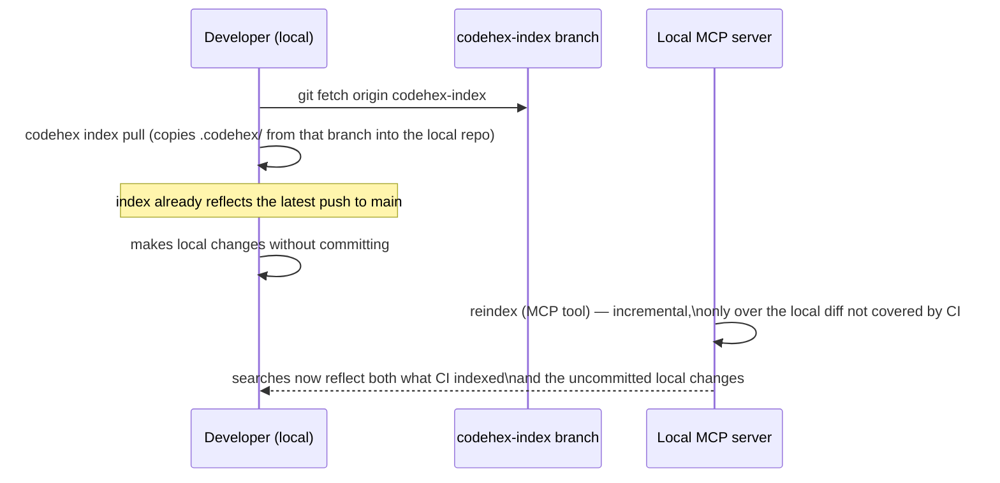

# 10 · GitHub Actions: automatic reindexing

## 1. The problem to solve

The MCP server (chapter 08) runs on the developer's machine and reads the local index (`<repo>/.codehex/`). If that index only gets updated when someone runs `codehex reindex` by hand, it goes stale as soon as someone else pushes changes the local developer doesn't have. GitHub Actions solves this by running the reindex **on every relevant change to the repository**, not only when someone remembers to.

This raises a design question that doesn't have a single correct answer: **if the index is generated in CI, how does it reach the developer's machine where the MCP server runs?**

## 2. Workflow triggers

```yaml
on:
  push:
    branches: [main]
  pull_request:
    branches: [main]
  schedule:
    - cron: "0 */6 * * *"   # safety net: full reindex every 6h, in case the incremental gets out of sync
  workflow_dispatch: {}      # manual trigger from the GitHub UI or `gh workflow run`
```

- **`push` to `main`**: the main case — every change that lands on the main branch triggers an incremental reindex.
- **`pull_request`**: optional, useful if you want to validate that a PR's code is indexable (the job fails if parsing breaks) without publishing the resulting index yet.
- **`schedule`**: a periodic safety net — if the incremental somehow got out of sync (e.g., a silent failure), a full reindex at regular intervals self-corrects.
- **`workflow_dispatch`**: to force a manual reindex without waiting for the next push.

## 3. What the job does

```yaml
name: Reindex code-RAG

on:
  push:
    branches: [main]
  workflow_dispatch: {}

jobs:
  reindex:
    runs-on: ubuntu-latest
    permissions:
      contents: write   # only needed if the index gets committed to a branch (option A, section 4)
    steps:
      - uses: actions/checkout@v4
        with:
          fetch-depth: 0   # full history: the incremental diff (chapter 07) needs it

      - uses: actions/setup-python@v5
        with:
          python-version: "3.12"

      - name: Install codehex
        run: pip install codehex

      - name: Restore previous index
        uses: actions/checkout@v4
        with:
          ref: codehex-index
          path: .codehex-previous
        continue-on-error: true   # this branch doesn't exist yet the first time

      - name: Reindex incrementally
        env:
          VOYAGE_API_KEY: ${{ secrets.VOYAGE_API_KEY }}
        run: |
          [ -d .codehex-previous/.codehex ] && cp -r .codehex-previous/.codehex .codehex
          codehex index --project . --root .

      - name: Publish updated index
        run: |
          git config user.name "codehex-bot"
          git config user.email "codehex-bot@users.noreply.github.com"
          git checkout -B codehex-index
          git add .codehex
          git commit -m "chore: reindex $(git rev-parse --short HEAD)" || echo "no changes"
          git push origin codehex-index --force
```

`fetch-depth: 0` is essential: the algorithm from chapter 07 needs `git diff` against a potentially old commit, and a shallow checkout (`fetch-depth: 1`, the default) doesn't have that history available.

## 4. Where to persist the index: options and trade-offs

| Option | How it works | Advantage | Cost |
|---|---|---|---|
| **A. Dedicated branch** (used above, e.g. `codehex-index`) | The job commits `.codehex/` to a branch separate from `main`, without mixing into the code history | Simple, version-controlled, with index history; the local developer can `git fetch` that branch and copy the index | The branch grows with each reindex (mitigable with `--force` overwriting, as above, instead of accumulating commits) |
| **B. GitHub Actions artifact** | The job uploads `.codehex/` as an artifact (`actions/upload-artifact`) | Doesn't clutter the repository with an extra branch | Artifacts expire (retention configurable, but not permanent storage); requires `gh run download` or the API to fetch it locally — less direct than a `git pull` |
| **C. Release asset** | The job publishes `.codehex/` packaged as an asset of a GitHub Release | Persistent, versioned per release, easy to reference by tag | Requires managing release versions just for this — more ceremony than needed if you just want "the most recent index" |
| **D. External storage** (S3/GCS bucket, artifact registry) | The job uploads the index to a store outside GitHub | Scales better if the index is large or several repos share CI/CD infrastructure | Adds an external infrastructure dependency and its credentials — disproportionate for a project meant to be "easy to stand up" |

**This guide's recommendation: option A (dedicated branch)**, following exactly the same pattern `kairosai` already uses for its own `kairosai` configuration branch — it's the option with the least new infrastructure (uses git, which you already have) and the simplest to sync locally (`git fetch origin codehex-index`).

## 5. How the local MCP server reconciles CI + local changes

The recommended flow for the developer:



`codehex index pull` (an additional CLI command, chapter 11) simply copies the contents of `.codehex/` from the remote branch into the local working tree — no merging is required because the index isn't source code a human edits, it's a rebuildable cache. From there, the MCP server's `reindex` tool does the usual thing (chapter 07): incremental diff, this time covering only the local changes CI hasn't seen yet.

## 6. Security

- **The embeddings API key lives as a GitHub Secret** (`secrets.VOYAGE_API_KEY`), never in the workflow or the repository — it's injected as an environment variable only in the step that needs it.
- **Minimal permissions**: the job only needs `contents: write` if it publishes to a branch (option A); with options B or C, not even that — use `permissions: contents: read` by default and explicitly add the minimum necessary, following the principle of least privilege.
- **Don't expose the workflow to `pull_request_target`** unless you know exactly why — that event grants access to secrets even on PRs from untrusted forks, a leak vector for the API key if the job executes the PR's code.

## Reusable ideas from existing projects

- **From `kairosai`**: the dedicated branch as a sync mechanism (`sync.py`, which pushes `.kairosai/` to a `kairosai` branch via automatic PR+merge) is the direct precedent for option A in this chapter — here simplified to a direct push with `--force` because the index doesn't need human review the way the configuration kairosai manages does.
- **From `code-rag-mcp`**: none — it has no CI automation, this is precisely the piece this guide adds on top of it.

## Next step

[11 · CLI and packaging](11-cli-y-empaquetado.md): how all of this gets distributed as an installable tool with a single command.
