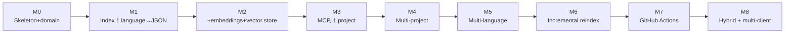

# 12 · Step-by-step guide

Build roadmap in incremental milestones. Each one produces something that works end to end (even if limited), instead of building all the layers at once with nothing runnable until the end. This order is designed to maximize early signal: you'll know whether a design decision was correct long before you've invested in the whole system.

## M0 — Skeleton and domain

**What to build:** the folder layout from chapter 03, the domain model (`domain/models.py`), and the port interfaces (with no implementation yet). `pyproject.toml` with the installable package.

**Definition of done:** `pip install -e .` works; `import codehex.domain.models` works; there's at least one test in `tests/domain/` that passes against a domain entity (even if trivial, it confirms the package and pytest are wired up correctly).

**Reference:** chapter 03.

## M1 — Single-language indexing to plain JSON

**What to build:** `TreeSitterPythonParser` (a single language, not all three yet), a fake or minimal `VectorStore` (it can literally be a JSON file with dummy embeddings — random vectors, without calling any real model yet), and the `IndexProject` use case connecting them. CLI: `codehex index --project <name>`.

**Definition of done:** you run `codehex index` on a test Python repo and get a file with chunks (symbol, path, lines) — no searching yet, just indexing and being able to inspect the result by eye.

**Reference:** chapters 03, 05 (Python part only).

**Why this order:** it validates the end-to-end pipeline (discover files → parse → persist) before complicating it with real embeddings or multiple languages. If something in the `CodeChunk` design doesn't fit well, you discover it here, cheaply.

## M2 — Real embeddings + vector store + semantic search

**What to build:** replace the fake `VectorStore` from M1 with a real `LanceDbVectorStore`, and add `LocalSentenceTransformerProvider` (lightweight model, chapter 06, section 1) as the first `EmbeddingProvider`. Implement `SearchCode` (semantic part only for now, no lexical yet). CLI: `codehex search "<query>" --project <name>`.

**Definition of done:** a search by meaning (e.g. "user validation") returns a relevant function even if the literal name doesn't match the query — this is proof that the semantic layer adds something over a simple `grep`.

**Reference:** chapter 06.

## M3 — MCP server, single project

**What to build:** the `adapters/mcp/server.py` adapter with FastMCP (chapter 08), exposing `search_code` and `get_source` at minimum. Connect it to Claude Code (chapter 09) pointing to a single hardcoded project (still no multi-project registry).

**Definition of done:** from a Claude Code session, the agent successfully invokes `search_code` and `get_source` against your test repo, and uses the result to answer a real question about the code.

**Reference:** chapters 08, 09 (Claude Code only for now).

**Why this order:** this is the first "demonstrable" milestone — seeing it actually work from a real client validates that everything before it (M0-M2) has the right shape to be consumed by an agent, before investing in more languages or more projects.

## M4 — Multi-project registry

**What to build:** `YamlProjectRegistry`, the `codehex project add/list/remove` commands, and add `project_id` as a mandatory parameter to all MCP tools (chapter 04). Add `list_projects` as a new tool.

**Definition of done:** two registered projects, queryable completely independently from the same MCP server, with no cross-results between them.

**Reference:** chapter 04.

## M5 — Multi-language

**What to build:** `TreeSitterJavaScriptParser`, `TreeSitterJavaParser`, and `GenericTextParser` as fallback (chapter 05), connected via `CompositeLanguageParser`.

**Definition of done:** a project with Python, JS, and Java files at once is indexed correctly, with chunks of the correct language for each file, without touching a single line of `IndexProject` or of the domain (if you touched anything outside `adapters/parsers/`, something in the port design isn't properly isolated — go back before continuing).

**Reference:** chapter 05.

## M6 — Incremental reindexing

**What to build:** `GitCliProvider` and `ReindexProject` (chapter 07), switching `reindex` from "always full" to "incremental when a previous index exists."

**Definition of done:** you modify a single file in an already-indexed repo, run `reindex`, and the execution time is noticeably shorter than a full `index` of the same repo — and the search results reflect the change.

**Reference:** chapter 07.

## M7 — GitHub Actions

**What to build:** the workflow from chapter 10, publishing the index to a dedicated branch, plus the `codehex index pull` command.

**Definition of done:** you push to `main` on a test repo, the workflow runs and publishes an updated index to the dedicated branch, and `codehex index pull` locally pulls it without errors.

**Reference:** chapter 10.

## M8 — Hybrid retrieval + multi-client installers

**What to build:** the lexical layer of `SearchCode` (chapter 06, section 3) combined with the semantic one; `codehex mcp install --client claude|codex|copilot` (chapter 09, section 5); optional layer/role classification if your use case justifies it (chapter 05, section 5).

**Definition of done:** a search for an exact symbol (e.g. the literal name of an exception) and a purely conceptual search both return good results from the same `search_code`; all three clients (Claude Code, Codex CLI, Copilot CLI) end up configured with a single command each.

**Reference:** chapters 06, 09.

## Visual summary

Following the exact order is not mandatory — for example, M5 (multi-language) and M6 (incremental) are independent of each other and could be swapped. What is worth respecting is the underlying dependency: M0-M2 before anything else (without a domain or basic pipeline there's nothing to build on), and M3 before investing in M4-M8 (validating against a real client early avoids discovering late that the tool surface doesn't match how an agent actually uses them).

## Next step

[13 · Glossary and references](13-glosario-y-referencias.md), as a reference to consult as you build.
